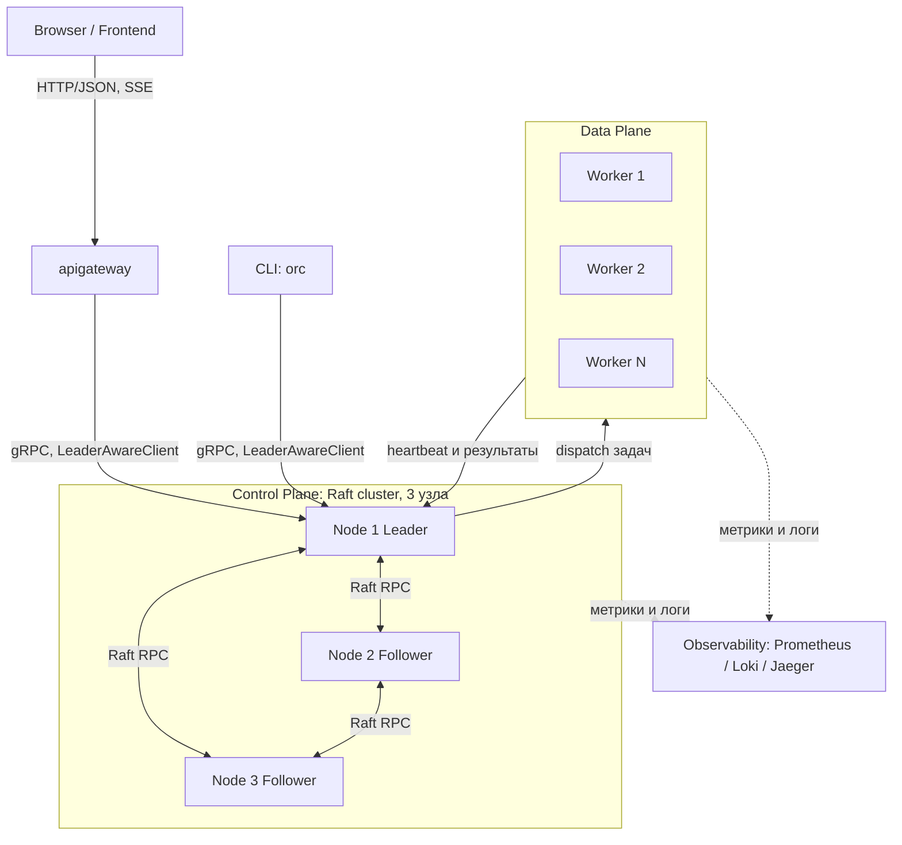

# ТЗ: Распределённая система оркестрации задач (Job/Workflow Orchestrator) на Go

> Основано на roadmap репозитория [Caesarsage/distributed-system](https://github.com/Caesarsage/distributed-system).
> Echo Server и Chat Server (Week 0–1) считаются пройденным этапом — на них вы отработали базовый TCP/сетевой код на Go.
> Этот документ описывает следующий, главный этап: Workflow Engine → Job Scheduler → Orchestration → Raft → Observability → Persistence → Multi-tenancy — как **одну связную систему**, а не 7 разрозненных мини-проектов.

---

## 0. Идея и цель проекта

Вы строите упрощённый аналог систем класса Temporal / Nomad / Kubernetes control-plane:

- пользователь описывает **Workflow** — граф задач (DAG) с зависимостями;
- **Scheduler** раскладывает задачи по **воркерам**;
- кластер из нескольких control-plane узлов **не имеет единой точки отказа** благодаря Raft-консенсусу;
- состояние кластера переживает рестарты (**persistence**);
- всё видно снаружи — логи, метрики, трейсы (**observability**);
- систему можно шарить между несколькими независимыми командами (**multi-tenancy**).

Цель ТЗ — дать вам структуру, интерфейсы, протоколы и последовательность шагов, чтобы вы реализовали это самостоятельно, понимая **зачем** нужен каждый компонент.

### 0.1 Из каких сервисов (бинарников) состоит система

Это стоит зафиксировать сразу, чтобы не путать роли дальше по документу — их **четыре**, все независимо запускаемые и деплоящиеся:

| Бинарник | Что это | Участвует в Raft-консенсусе? | Где описан |
|---|---|---|---|
| `cmd/control-plane` | реальный узел кластера — хранит `NodeState`, может быть Leader/Follower/Candidate | **да** | §3–§9 |
| `cmd/worker` | исполнитель задач | нет — снаружи кластера консенсуса | §6 |
| `cmd/orc` | CLI — тонкий клиент, вызывает control-plane по gRPC | нет — просто клиент, как `etcdctl`/`nomad` CLI | §10.3 |
| `cmd/apigateway` | HTTP/SSE-шлюз для браузера | нет — тоже клиент control-plane, просто для другой аудитории | §10.4 |

Важно не путать `orc` с `control-plane`: `orc` не "поднимает узел" и не бывает лидером — он снаружи Raft-кластера, как обычный клиент базы данных снаружи её реплик. Лидера выбирают между собой только `control-plane` узлы (§3.4); `orc`/`apigateway` только **обнаруживают**, кто сейчас лидер, через `LeaderAwareClient` (§10.2).

---

## 1. Высокоуровневая архитектура



**Принцип разделения ответственности:**

| Слой | Отвечает за | Не отвечает за |
|---|---|---|
| API Gateway | HTTP/JSON и SSE для фронтенда, rate limiting, трансляция в gRPC | принятие решений, бизнес-логику, финальную авторизацию (§10.4) |
| Control Plane (Raft-кластер) | принятие решений: кому какую задачу дать, кто лидер, консистентное состояние | реальное исполнение задач |
| Data Plane (воркеры) | исполнение задач (shell-команда / HTTP-запрос / функция) | принятие решений о расписании |
| Persistence | WAL + snapshot состояния кластера | бизнес-логику |
| Observability | видимость (логи/метрики/трейсы) | работу системы (не должна быть в критическом пути) |

Только **лидер** Raft-кластера принимает запросы на запись (создание workflow, назначение задач). Фолловеры реплицируют журнал и могут отвечать на read-only запросы (с оговорками, см. §7.5).

---

## 2. Доменная модель

Это ядро системы — определите его первым, всё остальное строится вокруг этих структур.

```go
// common/domain/domain.go
package domain

import "time"

// ID всех сущностей — обычный string (рекомендуется генерировать через ULID/UUIDv7,
// чтобы значения были сортируемы по времени — удобно для логов и хранилища).
// Отдельные типы под TenantID/WorkflowID/TaskID/WorkerID не заводим — это лишняя
// абстракция при таком размере системы; при необходимости всегда можно добавить позже.

// TaskStatus — конечный автомат состояния задачи
type TaskStatus string

const (
	TaskPending   TaskStatus = "PENDING"   // создана, ждёт, пока разрешатся зависимости
	TaskReady     TaskStatus = "READY"     // зависимости выполнены, ждёт свободного воркера
	TaskDispatched TaskStatus = "DISPATCHED" // отправлена воркеру, ждём подтверждения
	TaskRunning   TaskStatus = "RUNNING"   // воркер подтвердил запуск
	TaskSucceeded TaskStatus = "SUCCEEDED"
	TaskFailed    TaskStatus = "FAILED"
	TaskRetrying  TaskStatus = "RETRYING"
	TaskCancelled TaskStatus = "CANCELLED"
)

// Task — узел графа выполнения (DAG node)
type Task struct {
	ID           string
	WorkflowID   string
	Name         string
	DependsOn    []string          // рёбра графа: ID задач, завершения которых этот таск ждёт
	Command      TaskSpec          // что именно выполнять
	MaxRetries   int
	RetryBackoff time.Duration
	Timeout      time.Duration
	Status       TaskStatus
	AssignedTo   string            // WorkerID
	Attempt      int
	Result       *TaskResult
	CreatedAt    time.Time
	UpdatedAt    time.Time
}

// TaskSpec — абстракция типа задачи. Начните с одного типа (Shell), потом добавите HTTP/gRPC.
type TaskSpec struct {
	Type    string            // "shell" | "http" | "webhook"
	Payload map[string]string // например {"cmd": "echo hello"} или {"url": "...", "method": "POST"}
}

type TaskResult struct {
	ExitCode int
	Stdout   string
	Stderr   string
	Error    string
	Duration time.Duration
}

// WorkflowStatus — состояние графа целиком
type WorkflowStatus string

const (
	WorkflowPending   WorkflowStatus = "PENDING"
	WorkflowRunning   WorkflowStatus = "RUNNING"
	WorkflowSucceeded WorkflowStatus = "SUCCEEDED"
	WorkflowFailed    WorkflowStatus = "FAILED"
	WorkflowCancelled WorkflowStatus = "CANCELLED"
)

// Workflow — DAG задач
type Workflow struct {
	ID          string
	TenantID    string
	Name        string
	Tasks       map[string]*Task // ключ — Task.ID
	ReverseDeps map[string][]string // taskID -> ID задач, которые ОТ НЕГО зависят (обратные рёбра DependsOn).
	                                  // Строится один раз при создании (§4.1), нужен для каскадной отмены —
	                                  // без него пришлось бы каждый раз сканировать все задачи в поисках
	                                  // "у кого DependsOn содержит этот ID".
	Status    WorkflowStatus
	CreatedAt time.Time
	UpdatedAt time.Time
}

// WorkerNode — регистрация воркера в кластере
type WorkerNode struct {
	ID            string
	Address       string // host:port для gRPC
	Labels        map[string]string // например {"gpu":"true","region":"eu"} — для селекторов
	Capabilities  []string          // ["shell","http"] — какие типы задач умеет исполнять (§6.4)
	Capacity      int    // сколько задач параллельно может исполнять
	RunningTasks  int
	LastHeartbeat time.Time
	Status        WorkerStatus
}

type WorkerStatus string

const (
	WorkerAlive    WorkerStatus = "ALIVE"
	WorkerSuspect  WorkerStatus = "SUSPECT"  // пропустил heartbeat, но ещё в пределах grace period
	WorkerDead     WorkerStatus = "DEAD"
)

// Tenant — для multi-tenancy (см. §10)
type Tenant struct {
	ID         string
	Name       string
	APIKeyHash string
	Quota      ResourceQuota
}

type ResourceQuota struct {
	MaxConcurrentWorkflows int
	MaxTasksPerWorkflow    int
}
```

### Почему DAG, а не просто очередь

Workflow — это направленный ациклический граф: `Task.DependsOn` задаёт рёбра. Планировщик должен:
1. на старте вычислить множество задач без зависимостей → перевести их в `READY`;
2. когда задача переходит в `SUCCEEDED`, пересчитать, у каких задач все `DependsOn` теперь удовлетворены, и перевести их в `READY`;
3. если хоть одна зависимость `FAILED`/`CANCELLED` — зависящие задачи получают `CANCELLED` (или, по политике, `RETRYING` родителя).

Реализуйте валидацию DAG на этапе создания workflow: обход в глубину (DFS) с проверкой посещённых/в процессе узлов для обнаружения циклов — граф с циклом нужно отклонять сразу, до записи в Raft-лог.

---

## 3. Raft-консенсус (сердце Control Plane)

### 3.1 Зачем

Если control-plane — это один процесс, при его падении вы теряете весь кластер. Raft даёт вам:
- **Leader election** — автоматический выбор лидера, если текущий упал;
- **Log replication** — любое изменение состояния (создать workflow, назначить задачу) сначала попадает в реплицируемый журнал, и только когда его подтвердило большинство узлов (`quorum`), оно применяется к состоянию — это гарантирует, что состояние кластера не расходится и не теряется при падении меньшинства узлов.

### 3.2 Рекомендация по реализации

Не пишите Raft с нуля для продакшн-качества — это отдельная большая тема (описана в оригинальной статье Ongaro & Ousterhout, "In Search of an Understandable Consensus Algorithm"). Два варианта:

1. **Учебный путь (рекомендуется, раз цель — разобраться в фундаментали):** реализовать урезанный Raft самостоятельно — только leader election + log replication, без membership changes и log compaction на первой итерации. Это соответствует пунктам "Week 6/7" исходного roadmap.
2. **Инженерный путь:** взять `github.com/hashicorp/raft` как транспорт консенсуса и сосредоточиться на вашей `FSM` (state machine) поверх него — это ближе к тому, как реально устроены Nomad/Consul.

Ниже — контракты, которые нужны в любом случае.

### 3.3 Ключевые структуры

```go
package raft

type NodeState int

const (
	Follower NodeState = iota
	Candidate
	Leader
)

// LogEntry — одна запись реплицируемого журнала
type LogEntry struct {
	Term    uint64
	Index   uint64
	Command []byte // сериализованная команда (см. FSM ниже)
}

// PersistentState — то, что ДОЛЖНО пережить рестарт узла (пишется на диск до ответа на RPC)
type PersistentState struct {
	CurrentTerm uint64
	VotedFor    string // ID узла, за кого проголосовали в CurrentTerm ("" если ни за кого)
	Log         []LogEntry
}

// VolatileState — теряется при рестарте, восстанавливается заново
type VolatileState struct {
	CommitIndex uint64 // индекс последней закоммиченной (подтверждённой большинством) записи
	LastApplied uint64 // индекс последней записи, применённой к FSM
}

// Только для лидера, сбрасывается при каждом новом избрании
type LeaderVolatileState struct {
	NextIndex  map[string]uint64 // для каждого follower: индекс следующей записи для отправки
	MatchIndex map[string]uint64 // для каждого follower: индекс последней подтверждённой записи
}
```

### 3.4 RPC-протокол (2 обязательных RPC)

```go
// RequestVote — рассылается кандидатом при таймауте выборов
type RequestVoteArgs struct {
	Term         uint64
	CandidateID  string
	LastLogIndex uint64
	LastLogTerm  uint64
}
type RequestVoteReply struct {
	Term        uint64
	VoteGranted bool
}

// AppendEntries — используется и для репликации, и как heartbeat (с пустым Entries)
type AppendEntriesArgs struct {
	Term         uint64
	LeaderID     string
	PrevLogIndex uint64
	PrevLogTerm  uint64
	Entries      []LogEntry
	LeaderCommit uint64
}
type AppendEntriesReply struct {
	Term    uint64
	Success bool
	// Optimization: для быстрого отката NextIndex при рассинхроне
	ConflictIndex uint64
	ConflictTerm  uint64
}
```

**Логика в двух словах** (реализуйте это как явный конечный автомат, а не «россыпь goroutine с флагами» — так проще отлаживать):

- Follower стартует election timeout (случайный, например 150–300мс). Если не получил AppendEntries/RequestVote за это время — становится Candidate, увеличивает `CurrentTerm`, голосует за себя, рассылает `RequestVote` остальным.
- Получил большинство голосов → становится Leader, начинает слать периодические `AppendEntries` (heartbeat, интервал заметно меньше election timeout, например 50мс).
- Leader, получив запись от клиента, добавляет её в свой лог, реплицирует через `AppendEntries`, и как только запись подтверждена большинством — коммитит (двигает `CommitIndex`) и применяет к FSM.
- Любой узел, увидевший RPC/reply с бОльшим `Term`, немедленно становится Follower.

### 3.5 FSM — State Machine поверх Raft

Raft-журнал реплицирует **команды**, а не напрямую доменные объекты. Здесь важно разделение по слоям (§14.2): сам интерфейс `FSM` — часть `pkg/raft` и не знает, что такое `Workflow`, а вот конкретные команды и их применение — уже наша бизнес-логика в `infrastructure/control-plane/raftfsm`.

```go
// pkg/raft/fsm.go — generic-интерфейс, ничего не знает о домене
package raft

// FSM — интерфейс, который требует Raft-слой от любого потребителя
type FSM interface {
	Apply(entry LogEntry) (result interface{}, err error)
	Snapshot() (FSMSnapshot, error)
	Restore(snapshot []byte) error
}
```

```go
// infrastructure/control-plane/raftfsm/fsm.go — конкретная реализация под наш домен
package raftfsm

import (
	"distributed-orchestrator/common/domain"
	"distributed-orchestrator/pkg/raft"
)

type CommandType string

const (
	CmdCreateWorkflow   CommandType = "CREATE_WORKFLOW"
	CmdUpdateTaskStatus CommandType = "UPDATE_TASK_STATUS"
	CmdRegisterWorker   CommandType = "REGISTER_WORKER"
	CmdWorkerHeartbeat  CommandType = "WORKER_HEARTBEAT"
	CmdAssignTask       CommandType = "ASSIGN_TASK"
)

type Command struct {
	Type    CommandType
	Payload []byte // JSON/protobuf-сериализованный конкретный тип команды
}

// OrchestratorFSM реализует raft.FSM поверх доменной модели из common/domain
type OrchestratorFSM struct {
	mu            sync.RWMutex
	workflows     map[string]*domain.Workflow // ключ — Workflow.ID
	workers       map[string]*domain.WorkerNode // ключ — WorkerNode.ID
	tasksByWorker map[string][]string // workerID -> список TaskID, назначенных на него
}

func (f *OrchestratorFSM) Apply(entry raft.LogEntry) (interface{}, error) {
	// десериализовать entry.Command в Command, диспетчеризовать по Type, дальше — обновить
	// domain-состояние (workflows/workers) конкретно под тип команды.
	//
	// Обслуживание tasksByWorker НЕ размазывайте по типам команд (легко забыть один из кейсов
	// и рассинхронить индекс с реальным статусом). Вместо этого заведите единую внутреннюю
	// функцию updateTaskStatus(task, newStatus), через которую проходит ЛЮБОЙ переход статуса
	// задачи — и в CmdAssignTask (READY -> DISPATCHED), и в CmdUpdateTaskStatus (все остальные
	// переходы), и в переназначении при смерти воркера. Внутри неё — единственное место, где
	// индекс мутируется:
	//
	//   func (f *OrchestratorFSM) updateTaskStatus(task *domain.Task, newStatus domain.TaskStatus) {
	//       prevStatus := task.Status
	//       task.Status = newStatus
	//       switch {
	//       case newStatus == domain.TaskDispatched:
	//           // задача только что закреплена за task.AssignedTo — добавить в список.
	//           // Порядок внутри списка не важен, поэтому просто append, без поиска дублей.
	//           f.tasksByWorker[task.AssignedTo] = append(f.tasksByWorker[task.AssignedTo], task.ID)
	//       case prevStatus == domain.TaskDispatched || prevStatus == domain.TaskRunning:
	//           // задача только что ПЕРЕСТАЛА быть закреплена за воркером — не важно, куда
	//           // именно она ушла (READY при переназначении, SUCCEEDED/FAILED/CANCELLED) —
	//           // условие одно: "раньше была на воркере, теперь нет". removeTask ищет её
	//           // линейным перебором (задач на одном воркере обычно мало, ограничено Capacity,
	//           // так что O(n) здесь дешевле, чем городить map[string]struct{} ради O(1)).
	//           f.tasksByWorker[task.AssignedTo] = removeTask(f.tasksByWorker[task.AssignedTo], task.ID)
	//       }
	//   }
	//
	//   // removeTask — swap-remove: порядок элементов не важен, зато без лишних аллокаций
	//   func removeTask(ids []string, taskID string) []string {
	//       for i, id := range ids {
	//           if id == taskID {
	//               ids[i] = ids[len(ids)-1]
	//               return ids[:len(ids)-1]
	//           }
	//       }
	//       return ids
	//   }
	//
	// Такое условие "prevStatus было DISPATCHED/RUNNING, а новое — нет" сразу покрывает все
	// случаи выхода задачи из-под воркера одним проверяемым правилом, вместо того чтобы
	// перечислять терминальные статусы (SUCCEEDED/FAILED/CANCELLED/READY) вручную и рисковать
	// забыть один при добавлении нового статуса в будущем.
	// см. §3.6 про детерминизм
	return nil, nil
}

// TasksAssignedTo — O(k), где k — число задач именно на этом воркере,
// а не O(общее число задач во всех workflow). Используется в §6.3 при смерти воркера.
// Возвращает копию, а не сам внутренний срез — чтобы вызывающий код не мог случайно
// зателепать внутреннее состояние FSM через возвращённый слайс.
func (f *OrchestratorFSM) TasksAssignedTo(workerID string) []string {
	f.mu.RLock()
	defer f.mu.RUnlock()
	ids := f.tasksByWorker[workerID]
	out := make([]string, len(ids))
	copy(out, ids)
	return out
}
```

**Почему не `map[string]struct{}` (множество) вместо среза.** Множество даёт O(1) удаление вместо O(n), но платит за это лишней аллокацией map на каждого воркера и более тяжёлым API. При типичном размере (число задач на одном воркере ограничено его `Capacity` — единицы-десятки, не тысячи) линейный перебор среза на удаление быстрее в реальности, чем накладные расходы map, и код проще читать. Если когда-нибудь `Capacity` вырастет до сотен/тысяч параллельных задач на воркер — тогда есть смысл вернуться к множеству, но не раньше.

**Почему это НЕ отдельная Raft-команда, а побочный эффект внутри `Apply`.** `tasksByWorker` полностью выводим из уже существующих полей (`Task.AssignedTo` + `Task.Status`) — реплицировать его отдельно было бы дублированием источника истины и риском рассинхрона. Он безопасно пересчитывается детерминированно на каждом узле как побочный эффект применения уже реплицированных команд — это не нарушает детерминизм `Apply`, потому что вычисляется исключительно из данных самой команды, без обращения к времени/сети/рандому.

**Что с `Snapshot`/`Restore` (§7.3).** Индекс можно вообще не сериализовать в snapshot — после `Restore` из `workflows` (которые там уже есть) он за один проход пересчитывается заново при старте узла: это разовая стоимость `O(общее число задач)` **только при рестарте процесса**, а не при каждой смерти воркера, — как раз то, чего вы и хотели избежать.

Важно: `Apply` должен быть **детерминированным** — одинаковый вход даёт одинаковый выход на всех узлах (никаких `time.Now()`, `rand`, обращений к сети внутри `Apply`; время передавайте как поле команды, проставленное на этапе создания записи лидером).

### 3.6 Чтения: линеаризуемость vs производительность

- **Строгие чтения** (например, "актуальный статус workflow прямо сейчас"): лидер перед ответом должен подтвердить, что он всё ещё лидер (например, разослать heartbeat-раунд и дождаться quorum-ответов — это называется *read index*). Простая учебная версия: все reads тоже идут через лог (дорого, но просто и корректно).
- **Eventually-consistent чтения** (для дашборда, где не критична секундная задержка): можно читать с фолловеров напрямую из их локального применённого состояния.

Начните с первого варианта (просто и корректно), оптимизацию до read-index сделайте отдельным этапом, когда база уже работает.

---

## 4. Workflow Engine

Отвечает за интерпретацию DAG и переходы состояний задач. **Целевая архитектура** (после Этапа 5, §15) — работает поверх FSM, то есть каждое изменение статуса это команда, проходящая через Raft. **На Этапах 1–4** (Raft ещё не подключён) — тот же самый набор методов и то же поведение снаружи, но внутри `WorkflowEngine` хранит `workflows`/`tasksByWorker` как обычные поля `map[...]...` под собственным `sync.RWMutex`, без FSM/`raft.Node` вообще; `stateReader`/`raft.FSM` ниже — это то, во что эти поля переезжают на Этапе 5 (§5.3 плана внедрения), контракт методов (`TaskStatus`/`TasksAssignedTo`/`ReassignTask`/`SubmitWorkflow`/`OnTaskCompleted`) не меняется.

```go
// infrastructure/control-plane/engine/engine.go
package engine

import (
	"distributed-orchestrator/common/domain"
	"distributed-orchestrator/pkg/raft"
)

// stateReader — то немногое, что WorkflowEngine читает из FSM поверх generic raft.FSM.Apply.
// *raftfsm.OrchestratorFSM удовлетворяет этому интерфейсу неявно — конкретные геттеры лежат там (§3.5),
// raft.FSM их не содержит, потому что pkg/raft ничего не знает о Task/Workflow.
type stateReader interface {
	TaskStatus(taskID string) domain.TaskStatus
	TasksAssignedTo(workerID string) []string // §3.5 — обратный индекс, нужен §6.3 при смерти воркера
}

type WorkflowEngine struct {
	fsm   raft.FSM   // интерфейс из pkg/raft — запись команд
	state stateReader // конкретные геттеры поверх того же *raftfsm.OrchestratorFSM — чтение
	node  raft.Node   // текущий узел Raft (нужен, чтобы знать: лидер ли я)
}

// SubmitWorkflow вызывается из API. Валидирует DAG, затем проводит через Raft.
func (e *WorkflowEngine) SubmitWorkflow(ctx context.Context, wf domain.Workflow) (string, error)

// OnTaskCompleted вызывается, когда Scheduler получил результат от воркера.
// Пересчитывает READY-множество для зависимых задач.
//
// ВАЖНО про идемпотентность: первым делом проверьте текущий task.Status. Если он уже
// терминальный (SUCCEEDED/FAILED/CANCELLED) — результат опоздал (например, воркер успел
// прислать ReportResult ровно в момент CancelWorkflow/CancelTask, §4.3/§4.4, или после переназначения
// по смерти воркера, §6.3) и должен быть тихо проигнорирован: залогировать и вернуть nil,
// а не применять статус повторно и не считать это ошибкой — вызывающая сторона (воркер)
// не обязана знать, что задача уже неактуальна.
func (e *WorkflowEngine) OnTaskCompleted(ctx context.Context, taskID string, result domain.TaskResult) error

// CancelWorkflow — см. §4.3. Помечает CANCELLED все нетерминальные задачи workflow и
// возвращает те из них, что были DISPATCHED/RUNNING (вместе с воркером, на котором
// исполнялись) — чтобы вызывающая сторона могла разослать им CancelTask (§6.2).
// WorkflowEngine сам НЕ ходит по сети к воркерам — он не знает про WorkerClient (§6.1),
// это ответственность того, кто его вызывает (grpcserver-обработчик OrchestratorAPI.CancelWorkflow).
func (e *WorkflowEngine) CancelWorkflow(ctx context.Context, workflowID string) ([]RunningTaskRef, error)

// CancelTask — см. §4.4. Отменяет ОДНУ задачу (и каскадом — всё, что от неё зависит),
// не трогая независимые ветки того же workflow. Возвращает RunningTaskRef, если задача
// была DISPATCHED/RUNNING (nil, если она ещё не запускалась — отменять на воркере нечего).
func (e *WorkflowEngine) CancelTask(ctx context.Context, taskID string) (*RunningTaskRef, error)

// RunningTaskRef — пара (задача, воркер), достаточная, чтобы разослать CancelTask
type RunningTaskRef struct {
	TaskID   string
	WorkerID string
}

// TaskStatus — используется в §5.2 (retryQueue-триггер отслеживания задачи)
func (e *WorkflowEngine) TaskStatus(taskID string) domain.TaskStatus {
	return e.state.TaskStatus(taskID)
}

// TasksAssignedTo — используется в §6.3 (переназначение задач умершего воркера без скана всех workflow)
func (e *WorkflowEngine) TasksAssignedTo(workerID string) []string {
	return e.state.TasksAssignedTo(workerID)
}

// ReassignTask — переводит DISPATCHED/RUNNING задачу обратно в READY через Raft (CmdUpdateTaskStatus)
// и кладёт её в ReadyQueue планировщика. Вызывается из §6.3 при смерти воркера — по одной на каждый
// taskID из TasksAssignedTo, а не сканированием всех workflow.
func (e *WorkflowEngine) ReassignTask(ctx context.Context, taskID string) error

// recomputeReadyTasks — приватная функция: топологический пересчёт готовых к запуску задач
func (e *WorkflowEngine) recomputeReadyTasks(wf *domain.Workflow) []string // ID готовых к запуску задач
```

### 4.1 Каскадная отмена — что происходит с графом, когда задача падает или её отменяют

Вспомните граф из §16.5/ранних примеров:

```
build ──> test ──> deploy-api
                └─> deploy-worker

lintA ──> lintB   (независимая ветка, не связана с build)
```

Если `test` окончательно `FAILED` (после исчерпания `MaxRetries`, §5.2) или кто-то явно отменил именно `test` — `deploy-api`/`deploy-worker` **никогда не смогут стать `READY`** (их зависимость не `SUCCEEDED`). Их нельзя оставить вечно висеть в `PENDING` — нужно явно перевести в `CANCELLED`. При этом `lintA`/`lintB` — независимая ветка, её это не должно останавливать.

**Обратный индекс `ReverseDeps`** (§2) строится один раз при создании workflow, рядом с валидацией DAG:

```go
func buildReverseDeps(tasks map[string]*domain.Task) map[string][]string {
	reverse := make(map[string][]string)
	for _, t := range tasks {
		for _, depID := range t.DependsOn {
			reverse[depID] = append(reverse[depID], t.ID) // "от depID зависит t.ID"
		}
	}
	return reverse
}
```

**`cancelDownstream`** — BFS по обратным рёбрам, общий механизм и для падения задачи, и для ручной отмены одной задачи (§4.4):

```go
// cancelDownstream рекурсивно отменяет ещё не запущенные задачи, зависящие (прямо или
// транзитивно) от rootID — без этого их зависимости никогда не станут SUCCEEDED, и workflow
// никогда не дойдёт до терминального состояния, а зависнет в RUNNING навсегда.
func (e *WorkflowEngine) cancelDownstream(ctx context.Context, wf *domain.Workflow, rootID string) {
	queue := []string{rootID}
	for len(queue) > 0 {
		id := queue[0]
		queue = queue[1:]

		for _, dependentID := range wf.ReverseDeps[id] {
			task := wf.Tasks[dependentID]
			if task.Status == domain.TaskSucceeded || task.Status == domain.TaskFailed || task.Status == domain.TaskCancelled {
				continue // уже терминальна (в т.ч. уже отменена в этом же обходе) — не трогаем
			}
			e.UpdateTaskStatus(ctx, task, domain.TaskCancelled)
			queue = append(queue, dependentID) // и её "потомков" тоже каскадом
		}
	}
}
```

Вызывается из `OnTaskCompleted`, когда задача окончательно `FAILED` (после исчерпания ретраев):

```go
func (e *WorkflowEngine) OnTaskCompleted(ctx context.Context, taskID string, result domain.TaskResult) error {
	// ... проверка идемпотентности из блока выше ...

	task.Attempt++
	if result.ExitCode != 0 && task.Attempt < task.MaxRetries {
		return nil // retryQueue (§5.2) сам вернёт задачу в READY после RetryBackoff
	}

	newStatus := domain.TaskSucceeded
	if result.ExitCode != 0 {
		newStatus = domain.TaskFailed
	}
	e.UpdateTaskStatus(ctx, task, newStatus)

	if newStatus == domain.TaskFailed {
		e.cancelDownstream(ctx, wf, task.ID)
	} else {
		newlyReady := e.recomputeReadyTasks(wf)
		for _, id := range newlyReady {
			readyTask := wf.Tasks[id]
			e.UpdateTaskStatus(ctx, readyTask, domain.TaskReady)
			e.pushToScheduler(readyTask)
		}
	}

	e.finalizeWorkflowIfDone(ctx, wf) // §4.2
	return nil
}
```

### 4.2 Финализация workflow

```go
// finalizeWorkflowIfDone проверяет, завершены ли все задачи графа, и переводит workflow
// в терминальный статус. НЕ вызывайте это сразу после падения одной задачи — дождитесь,
// пока ВСЕ ветки (включая независимые, не задетые каскадом) дойдут до терминального статуса,
// иначе независимая lintA/lintB может быть прервана раньше времени.
func (e *WorkflowEngine) finalizeWorkflowIfDone(ctx context.Context, wf *domain.Workflow) {
	hasActive, hasFailed, hasCancelled := false, false, false

	for _, t := range wf.Tasks {
		switch t.Status {
		case domain.TaskPending, domain.TaskReady, domain.TaskDispatched, domain.TaskRunning, domain.TaskRetrying:
			hasActive = true
		case domain.TaskFailed:
			hasFailed = true
		case domain.TaskCancelled:
			hasCancelled = true
		}
	}
	if hasActive {
		return // есть ещё незавершённые ветки — рано подводить итог
	}

	switch {
	case hasFailed:
		e.UpdateWorkflowStatus(ctx, wf, domain.WorkflowFailed) // реальный сбой важнее отмены — приоритет
	case hasCancelled:
		e.UpdateWorkflowStatus(ctx, wf, domain.WorkflowCancelled)
	default:
		e.UpdateWorkflowStatus(ctx, wf, domain.WorkflowSucceeded)
	}
}
```

**Опционально — политика fail-fast.** Если вместо "независимые ветки доходят до конца" нужно поведение "упала любая задача — сразу остановить вообще всё" (некоторым CI/CD pipeline это важнее, чем сэкономленное время на догоне независимых веток) — заведите явное поле, а не делайте это поведением по умолчанию:

```go
type Workflow struct {
	// ...
	FailFast bool // если true — при первом TaskFailed все ещё PENDING/READY задачи, включая
	              // независимые, тоже -> CANCELLED (не только вниз по графу от упавшей)
}
```

### 4.3 Отмена всего workflow

Два независимых действия, оба обязательны:

1. **Пометить состояние в control-plane** — это источник истины, происходит сразу и синхронно через Raft. Пока это не сделано, `recomputeReadyTasks`/`Scheduler` продолжат считать отменённые задачи живыми.
2. **Уведомить воркеров, у кого сейчас реально исполняются (`DISPATCHED`/`RUNNING`) задачи этого workflow** — иначе воркер продолжит жечь CPU/память на процесс, результат которого уже никому не нужен, до истечения собственного `Timeout` задачи.

Это **не блокирующая друг друга** пара действий — control-plane не ждёт подтверждения от воркера, что тот реально остановился, прежде чем считать задачу `CANCELLED`. Решение оптимистичное: control-plane сразу коммитит `CANCELLED` (шаг 1), а уведомление воркера (шаг 2) — best-effort сайд-эффект. Раз возможна гонка (воркер уже отправил `ReportResult` ровно тогда же, когда пришла отмена) — идемпотентность закрывается проверкой терминального статуса в `OnTaskCompleted` (§4), а не ожиданием ack от воркера.

```go
func (e *WorkflowEngine) CancelWorkflow(ctx context.Context, workflowID string) ([]RunningTaskRef, error) {
	wf, ok := e.workflows[workflowID] // или e.state.Workflow(workflowID) в версии после Этапа 5
	if !ok {
		return nil, fmt.Errorf("workflow not found %s", workflowID)
	}

	var running []RunningTaskRef
	for _, task := range wf.Tasks {
		switch task.Status {
		case domain.TaskSucceeded, domain.TaskFailed, domain.TaskCancelled:
			continue // терминальные — трогать нечего
		case domain.TaskDispatched, domain.TaskRunning:
			running = append(running, RunningTaskRef{TaskID: task.ID, WorkerID: task.AssignedTo})
		}
		e.UpdateTaskStatus(ctx, task, domain.TaskCancelled) // PENDING/READY/DISPATCHED/RUNNING -> CANCELLED
	}

	e.UpdateWorkflowStatus(ctx, wf, domain.WorkflowCancelled)
	return running, nil
}
```

Обработчик `OrchestratorAPI.CancelWorkflow` (§10.1) дальше, уже вне `WorkflowEngine`, рассылает уведомления по списку `running`:

```go
// infrastructure/control-plane/grpcserver/orchestrator_api.go
func (s *Server) CancelWorkflow(ctx context.Context, req *orchestratorpb.CancelWorkflowRequest) (*orchestratorpb.CancelWorkflowResponse, error) {
	running, err := s.engine.CancelWorkflow(ctx, req.WorkflowId)
	if err != nil {
		return nil, err
	}
	notifyWorkersOfCancellation(s, running) // общий хелпер, см. §4.4 — используется и здесь, и там
	return &orchestratorpb.CancelWorkflowResponse{Accepted: true}, nil
}
```

### 4.4 Отмена отдельной задачи

Тот же паттерн (§4.3), просто на одну задачу — плюс каскад на её зависимых через `cancelDownstream` (§4.1). Это то, чего **нет** у `CancelWorkflow` (там каскад не нужен — отменяются вообще все нетерминальные задачи разом):

```go
func (e *WorkflowEngine) CancelTask(ctx context.Context, taskID string) (*RunningTaskRef, error) {
	task, ok := e.taskIndex[taskID]
	if !ok {
		return nil, fmt.Errorf("task not found %s", taskID)
	}
	if task.Status == domain.TaskSucceeded || task.Status == domain.TaskFailed || task.Status == domain.TaskCancelled {
		return nil, fmt.Errorf("task %s already terminal: %s", taskID, task.Status) // не идемпотентно молчим — это
		                                                                             // явный вызов пользователя, а не
		                                                                             // фоновый сигнал от воркера
	}

	var ref *RunningTaskRef
	if task.Status == domain.TaskDispatched || task.Status == domain.TaskRunning {
		ref = &RunningTaskRef{TaskID: task.ID, WorkerID: task.AssignedTo}
	}

	e.UpdateTaskStatus(ctx, task, domain.TaskCancelled)
	wf := e.workflows[task.WorkflowID]
	e.cancelDownstream(ctx, wf, task.ID) // §4.1 — та же самая функция, что и при падении задачи
	e.finalizeWorkflowIfDone(ctx, wf)    // §4.2 — вдруг это была последняя активная ветка

	return ref, nil
}
```

```protobuf
// docs/proto/orchestrator.proto — дополнение к service OrchestratorAPI (§10.1)
rpc CancelTask(CancelTaskRequest) returns (CancelTaskResponse);

message CancelTaskRequest {
  string task_id = 1;
}
message CancelTaskResponse {
  bool accepted = 1;
}
```

**Не путайте с `WorkerRPC.CancelTask` (§6.2)** — это два разных RPC с одинаковым именем в разных proto-сервисах (никакого конфликта в сгенерированном коде, они в разных пакетах `orchestratorpb`/`workerpb`): один — клиент → control-plane ("отмени задачу X"), другой — control-plane → воркер ("останови процесс задачи X"). `OrchestratorAPI.CancelTask` **вызывает** `WorkerRPC.CancelTask` внутри себя, если задача была активна:

```go
func (s *Server) CancelTask(ctx context.Context, req *orchestratorpb.CancelTaskRequest) (*orchestratorpb.CancelTaskResponse, error) {
	ref, err := s.engine.CancelTask(ctx, req.TaskId)
	if err != nil {
		return nil, err
	}
	if ref != nil {
		notifyWorkersOfCancellation(s, []engine.RunningTaskRef{*ref}) // общий хелпер с §4.3
	}
	return &orchestratorpb.CancelTaskResponse{Accepted: true}, nil
}

// notifyWorkersOfCancellation — общий best-effort рассыльщик WorkerRPC.CancelTask (§6.2),
// переиспользуется и CancelWorkflow (§4.3), и CancelTask (это место)
func notifyWorkersOfCancellation(s *Server, refs []engine.RunningTaskRef) {
	for _, ref := range refs {
		go func(ref engine.RunningTaskRef) {
			ctx, cancel := context.WithTimeout(context.Background(), 5*time.Second)
			defer cancel()
			if _, err := s.workerClient.CancelTask(ctx, ref.WorkerID, ref.TaskID); err != nil {
				s.log.Warn("failed to notify worker about cancellation", "task", ref.TaskID, "worker", ref.WorkerID, "err", err)
			}
		}(ref)
	}
}
```

**Не дублируйте код постановки задачи в очередь планировщика.** И `recomputeReadyTasks` (первичный перевод в `READY`), и `ReassignTask` (повторная постановка после смерти воркера) заканчиваются одним и тем же действием — задача уходит в `Scheduler`. Вынесите это в отдельный приватный метод (например `pushToScheduler(task)`), который вызывают оба места, а не копируйте сборку запроса/колбэка дважды — иначе при изменении формата задачи для планировщика придётся синхронно править оба места, и рано или поздно один забудут.

**Валидация DAG при создании** (обязательно, до попадания в Raft-лог, чтобы не тратить консенсус на заведомо невалидные данные):
1. Все `TaskID` в `DependsOn` существуют в рамках этого workflow.
2. Нет циклов (DFS с тремя цветами: white/gray/black).
3. Нет "осиротевших" задач без пути к корню (опционально, по вашей политике).

---

## 5. Job Scheduler

Раскладывает `READY`-задачи по воркерам.

### 5.1 Подбор воркера

```go
// infrastructure/control-plane/scheduler/scheduler.go
package scheduler

type Scheduler struct {
	workerRegistry *orchestration.WorkerRegistry // §6.1
	workerClient   orchestration.WorkerClient     // §6.1 — gRPC-клиент к WorkerRPC.Dispatch
	queue          *ReadyQueue                    // задачи в статусе READY, ждущие назначения
	retryQueue     *retryqueue.RetryQueue         // pkg/retryqueue, см. §5.2
	engine         *engine.WorkflowEngine         // §4 — TaskStatus для retryQueue-триггера в commitAssignment
}

// SelectWorker — алгоритм подбора. Начните с простого, усложняйте по мере роста требований.
func (s *Scheduler) SelectWorker(task domain.Task, workers []domain.WorkerNode) (string, error) // возвращает WorkerNode.ID
```

**Алгоритмы `SelectWorker`, от простого к сложному** (реализуйте по очереди, это хороший инкрементальный план):
0. *Capability filter* (обязательный, самый первый) — воркер должен уметь исполнять именно этот `task.Command.Type`. Без этого шага задача может уйти воркеру, у которого просто нет нужного `Executor` (§6.4), и `Dispatch` бессмысленно провалится.
1. *Round-robin* среди `ALIVE`-воркеров с `RunningTasks < Capacity`.
2. *Least-loaded* — воркер с минимальным `RunningTasks / Capacity`.
3. *Label selector* — задача может требовать `Labels` (например `gpu: true`), фильтруем воркеров по совпадению меток до применения least-loaded.
4. (опционально) *Bin-packing* с учётом заявленных ресурсов задачи (cpu/mem), если добавите такие поля в `TaskSpec`.

```go
func (s *Scheduler) SelectWorker(task domain.Task, workers []domain.WorkerNode) (string, error) {
	candidates := filterByCapability(workers, task.Command.Type) // шаг 0, всегда первый
	if len(candidates) == 0 {
		return "", fmt.Errorf("no worker capable of executing type %s", task.Command.Type)
	}
	// дальше — шаги 1-4 уже по candidates, не по всем workers
}
```

**Разные пулы воркеров из одного бинарника.** Не пишите отдельные Go-программы под каждый тип задачи (`cmd/worker-shell`, `cmd/worker-http`) — это дублирует код регистрации/heartbeat/gRPC-сервера. Один и тот же `cmd/worker` (§6.4, executor registry) получает разный набор `Capabilities` через конфиг при деплое:

```yaml
# worker-shell-pool.yaml — тяжёлые задачи, можно держать в более закрытом сетевом сегменте
executors: [shell]
capacity: 4
labels: {pool: "shell-heavy"}
---
# worker-http-pool.yaml — лёгкие задачи, масштабируется независимо и агрессивнее
executors: [http]
capacity: 50
labels: {pool: "http-light"}
```

Это даёт независимое масштабирование (можно поднять 50 реплик `http`-пула и 2 реплики `shell`-пула) и изоляцию по безопасности (компрометация `shell`-воркера, который исполняет произвольные команды, не даёт доступа к процессу, обрабатывающему `http`-задачи), не платя ценой дублирования кода воркера — код один, разный только конфиг запуска.

**Важно:** назначение задачи воркеру — это тоже команда через Raft (`CmdAssignTask`), а не прямой gRPC-вызов из планировщика напрямую в воркер до записи в лог. Порядок:
1. Лидер решает: `task X → worker Y`.
2. Лидер проводит `AssignTask` через Raft (реплицируется, коммитится).
3. Только после коммита — лидер реально шлёт gRPC-вызов воркеру `Dispatch(task)`.

Это гарантирует: если лидер упадёт сразу после решения, но до отправки — новый лидер увидит из лога, что задача уже назначена, и либо повторно отправит, либо (с timeout) сочтёт назначение протухшим и переназначит.

### 5.2 Как это крутится в цикле

Планировщик работает **только на лидере** — follower'ы ничего не назначают, иначе два узла могли бы независимо принять разные решения по одной и той же задаче.

```go
func (s *Scheduler) Run(ctx context.Context) {
	ticker := time.NewTicker(200 * time.Millisecond)
	defer ticker.Stop()

	for {
		select {
		case <-ctx.Done():
			return
		case <-ticker.C: // страховочный тик — на случай, если событие потерялось
			if !s.raftNode.IsLeader() {
				continue
			}
			s.assignOnce(ctx)
		}
	}
}
```

Помимо тикера, `assignOnce` стоит вызывать сразу по событиям — новая задача стала `READY` (§4, `OnTaskCompleted`), новый воркер зарегистрировался (§6.1), воркер помечен `DEAD` и его задачи вернулись в очередь (§6.3) — тикер тут просто страховка, а не основной механизм.

```go
func (s *Scheduler) assignOnce(ctx context.Context) {
	readyTasks := s.queue.PopBatch(50) // не раздаём всю очередь за один присест
	workers := s.workerRegistry.AliveWorkers()

	for _, task := range readyTasks {
		workerID, err := s.SelectWorker(task, workers)
		if err != nil {
			s.queue.Push(task) // нет подходящего воркера прямо сейчас — вернуть, попробуем на след. тике
			continue
		}
		if err := s.commitAssignment(ctx, task, workerID); err != nil {
			s.queue.Push(task) // не прошло через Raft (например, потеряли лидерство) — вернуть
			continue
		}
		s.workerRegistry.IncrementRunning(workerID) // учитываем занятость СРАЗУ, не дожидаясь heartbeat —
		                                              // иначе следующая задача в этом же батче может уйти туда же
	}
}
```

**Retry самой задачи** (`Task.MaxRetries`/`RetryBackoff`) удобно завести через `pkg/retryqueue` — тот же паттерн "повторяй, пока не false, с таймаутом между попытками":

```go
func (s *Scheduler) commitAssignment(ctx context.Context, task domain.Task, workerID string) error {
	// 1. провести CmdAssignTask через Raft — коммитим РЕШЕНИЕ, ещё до реального сетевого вызова
	if err := s.raftAssignTask(ctx, task.ID, workerID); err != nil {
		return err
	}

	// 2. только после коммита — реальный gRPC-вызов воркеру
	req := util.TaskToDispatchRequest(task) // common/util, конвертер domain.Task -> workerpb.DispatchRequest
	resp, err := s.workerClient.Dispatch(ctx, workerID, req)
	if err != nil || !resp.Accepted {
		return fmt.Errorf("dispatch to worker %s failed: %w", workerID, err)
	}

	// 3. завести наблюдение за задачей — жива ли она, не пора ли retry
	s.retryQueue.Push(retryqueue.CommonRetryTrigger{
		Key:     task.ID,
		Timeout: task.RetryBackoff,
		Do: func(ctx context.Context) bool {
			status := s.engine.TaskStatus(task.ID)
			if status == domain.TaskSucceeded {
				return false // готово — больше не проверяем
			}
			if status == domain.TaskFailed && task.Attempt >= task.MaxRetries {
				return false // попытки исчерпаны
			}
			if status == domain.TaskFailed {
				s.queue.Push(task.ID) // вернуть в очередь на новую попытку
			}
			return true // продолжаем следить
		},
	})
	return nil
}
```

Когда задача реально завершается успешно — `OnTaskCompleted` (§4) должен вызвать `retryQueue.Cancel(taskID)`, чтобы не проверять её впустую.

---

## 6. Кластерная оркестрация: воркеры

### 6.1 WorkerRegistry

Реестр живых воркеров — держит кластерное состояние и здоровье каждого воркера. Живёт на control-plane, доступен и `Scheduler`, и health-check циклу.

**Важно про зависимости:** `WorkerRegistry` — низкоуровневый компонент (§14.2), он не должен импортировать `WorkerClient`/gRPC-детали, чтобы закрыть соединение при смерти воркера. Вместо прямого вызова — Observer-паттерн: `Registry` хранит список колбэков `func(workerID string)` и зовёт их всех, когда воркер умер, не зная, что конкретно эти колбэки делают.

```go
// infrastructure/control-plane/orchestration/registry.go
package orchestration

// taskReassigner — то немногое, что WorkerRegistry нужно от WorkflowEngine при смерти воркера.
// *engine.WorkflowEngine удовлетворяет этому интерфейсу неявно.
type taskReassigner interface {
	TasksAssignedTo(workerID string) []string        // §4 — обратный индекс из FSM
	ReassignTask(ctx context.Context, taskID string) error // §4 — перевод DISPATCHED/RUNNING -> READY через Raft
}

type WorkerRegistry struct {
	mu          sync.RWMutex
	workers     map[string]*domain.WorkerNode // ключ — WorkerNode.ID
	retryQueue  *retryqueue.RetryQueue         // pkg/retryqueue — health-check по dead man's switch
	onDeadHooks []func(workerID string)        // подписчики на "воркер умер"; Registry не знает, что внутри
	engine      taskReassigner                  // нужен только в markDead, см. §6.3
}

func NewWorkerRegistry(retryQueue *retryqueue.RetryQueue, engine taskReassigner) *WorkerRegistry {
	return &WorkerRegistry{
		workers:    make(map[string]*domain.WorkerNode),
		retryQueue: retryQueue,
		engine:     engine,
	}
}

// OnWorkerDead — регистрация подписчика. Вызывается один раз при сборке зависимостей в main.go,
// ДО того как в реестр начнут регистрироваться воркеры.
func (r *WorkerRegistry) OnWorkerDead(hook func(workerID string)) {
	r.onDeadHooks = append(r.onDeadHooks, hook)
}

// Register — обработчик ClusterService.Register (§6.2)
func (r *WorkerRegistry) Register(w domain.WorkerNode) error

// Heartbeat — обработчик ClusterService.Heartbeat (§6.2)
func (r *WorkerRegistry) Heartbeat(workerID string, runningTasks int) error

func (r *WorkerRegistry) AliveWorkers() []domain.WorkerNode
func (r *WorkerRegistry) IncrementRunning(workerID string)
func (r *WorkerRegistry) AddressOf(workerID string) string // нужен WorkerClient, см. ниже
```

**`WorkerClient`** — то, чем `Scheduler` реально стучится к воркеру по сети (§5.2, `commitAssignment`). Заведён отдельно от `WorkerRegistry`, чтобы `Scheduler` зависел только от узкого контракта "могу отправить задачу", а не от всего реестра с его health-check и мутациями. `WorkerClient`, в свою очередь, ничего не знает про `WorkerRegistry` как тип — только про узкий `addressResolver`:

```go
// infrastructure/control-plane/orchestration/worker_client.go
package orchestration

// WorkerClient — контракт, которого достаточно Scheduler'у. Реализуется GRPCWorkerClient ниже,
// но в тестах Scheduler подставляет мок этого интерфейса, не поднимая реальную сеть.
type WorkerClient interface {
	Dispatch(ctx context.Context, workerID string, req *workerpb.DispatchRequest) (*workerpb.DispatchResponse, error)
}

// addressResolver — то немногое, что нужно от WorkerRegistry: только чтение адреса.
// *WorkerRegistry уже удовлетворяет этому интерфейсу неявно — ничего дополнительно делать не нужно.
type addressResolver interface {
	AddressOf(workerID string) string
}

// GRPCWorkerClient — держит переиспользуемые gRPC-соединения к воркерам, по одному на воркера.
type GRPCWorkerClient struct {
	mu       sync.Mutex
	conns    map[string]*grpc.ClientConn
	resolver addressResolver
}

func NewGRPCWorkerClient(resolver addressResolver) *GRPCWorkerClient {
	return &GRPCWorkerClient{
		conns:    make(map[string]*grpc.ClientConn),
		resolver: resolver,
	}
}

func (c *GRPCWorkerClient) Dispatch(ctx context.Context, workerID string, req *workerpb.DispatchRequest) (*workerpb.DispatchResponse, error) {
	conn, err := c.getOrDial(workerID)
	if err != nil {
		return nil, err
	}
	return workerpb.NewWorkerRPCClient(conn).Dispatch(ctx, req)
}

func (c *GRPCWorkerClient) getOrDial(workerID string) (*grpc.ClientConn, error) {
	c.mu.Lock()
	defer c.mu.Unlock()
	if conn, ok := c.conns[workerID]; ok {
		return conn, nil
	}
	addr := c.resolver.AddressOf(workerID)
	conn, err := grpc.NewClient(addr, grpc.WithTransportCredentials(insecure.NewCredentials()))
	if err != nil {
		return nil, err
	}
	c.conns[workerID] = conn
	return conn, nil
}

// CloseConn — сигнатура подходит под func(workerID string), поэтому её можно напрямую
// передать в registry.OnWorkerDead без обёрток
func (c *GRPCWorkerClient) CloseConn(workerID string) {
	c.mu.Lock()
	defer c.mu.Unlock()
	if conn, ok := c.conns[workerID]; ok {
		conn.Close()
		delete(c.conns, workerID)
	}
}
```

Сборка в `cmd/control-plane/main.go` — единственное место во всей системе, где `WorkerRegistry` и `WorkerClient` вообще узнают друг о друге:

```go
wfEngine := engine.New(fsm, raftNode)                          // §4 — сначала engine, ему нужны только fsm/raftNode
registry := orchestration.NewWorkerRegistry(retryQueue, wfEngine) // *engine.WorkflowEngine неявно реализует taskReassigner
workerClient := orchestration.NewGRPCWorkerClient(registry)       // *WorkerRegistry неявно реализует addressResolver
registry.OnWorkerDead(workerClient.CloseConn)                     // подписка: сигнатуры совпадают один в один

sched := scheduler.New(registry, workerClient, readyQueue, retryQueue, wfEngine)
```

Если позже понадобится ещё один подписчик на "воркер умер" (например, метрика `worker_deaths_total` или пересчёт квот тенанта) — это ещё одна строчка `registry.OnWorkerDead(...)` в `main.go`, без единой правки в `WorkerRegistry` или `WorkerClient`.

### 6.2 Протокол (регистрация, heartbeat, диспатч)

Важно: gRPC-`service` всегда реализуется одной стороной (сервером) и вызывается другой (клиентом) — нельзя в одном service-блоке смешать RPC, которые вызывают в разные стороны. Поэтому здесь **два разных сервиса**, у каждого свой сервер:

- **`ClusterService`** — сервер поднимает **control-plane**, вызывает **воркер** (регистрация, heartbeat, отчёт о результате).
- **`WorkerRPC`** — сервер поднимает **воркер**, вызывает **control-plane** (диспатч задачи).

```protobuf
// docs/proto/worker.proto — сгенерированный код -> common/api/workerpb

// Реализует control-plane. Вызывает воркер.
service ClusterService {
  rpc Register(RegisterRequest) returns (RegisterResponse);
  rpc Heartbeat(HeartbeatRequest) returns (HeartbeatResponse);
  rpc ReportResult(ResultRequest) returns (ResultResponse);
}

// Реализует воркер. Вызывает control-plane (после того как решил, кому назначить задачу).
service WorkerRPC {
  rpc Dispatch(DispatchRequest) returns (DispatchResponse);
  rpc CancelTask(CancelTaskRequest) returns (CancelTaskResponse); // §4.3/§4.4 — best-effort остановка исполнения
}

message RegisterRequest {
  string worker_id = 1;
  string address = 2;
  map<string, string> labels = 3;
  int32 capacity = 4;
  repeated string capabilities = 5; // ["shell","http"] — какие типы задач умеет исполнять, §6.4
}
message RegisterResponse {
  bool accepted = 1;
  string reason = 2; // заполнено, если accepted == false (например, дубликат worker_id)
}

message HeartbeatRequest {
  string worker_id = 1;
  int32 running_tasks = 2;
}
message HeartbeatResponse {
  bool acknowledged = 1;
}

message DispatchRequest {
  string task_id = 1;
  string type = 2;              // "shell" | "http"
  map<string, string> payload = 3;
  int64 timeout_seconds = 4;
}
message DispatchResponse {
  bool accepted = 1;   // воркер подтвердил приём задачи (Capacity позволяет запустить)
  string reason = 2;   // заполнено, если accepted == false ("worker busy" и т.п.)
}

message CancelTaskRequest {
  string task_id = 1;
}
message CancelTaskResponse {
  bool cancelled = 1; // false, если воркер уже не исполняет эту задачу (завершилась/никогда не была здесь) —
                       // это НЕ ошибка, а нормальный исход гонки с естественным завершением задачи
}

message ResultRequest {
  string task_id = 1;
  int32 exit_code = 2;
  string stdout = 3;
  string stderr = 4;
  string error = 5;
}
message ResultResponse {
  bool acknowledged = 1;
}
```

**Как это выглядит целиком по шагам:**
1. Воркер стартует → вызывает `ClusterService.Register` на control-plane → `WorkerRegistry.Register` (§6.1) добавляет запись → получает `RegisterResponse{accepted: true}`.
2. Воркер каждые N секунд вызывает `ClusterService.Heartbeat` → `WorkerRegistry.Heartbeat` обновляет `LastHeartbeat` и сбрасывает health-check таймер (§6.3).
3. Control-plane (лидер) решил, что задача X идёт воркеру Y → сам, как **клиент**, вызывает `WorkerRPC.Dispatch` по адресу воркера Y (тот самый `Address` из `RegisterRequest`) → получает `DispatchResponse{accepted: true}`.
4. Когда задача реально завершилась — воркер вызывает `ClusterService.ReportResult` на control-plane с результатом.
5. Если workflow или отдельная задача отменены (§4.3/§4.4) — control-plane, тоже как **клиент**, вызывает `WorkerRPC.CancelTask` на воркере, где задача сейчас исполняется — best-effort, не блокирует ответ клиенту на `CancelWorkflow`.

### 6.3 Health checking (failure detection)

Реализуйте через тот же `pkg/retryqueue`, что и retry задач (§5.2) — это тот же паттерн "dead man's switch": таймер, который срабатывает, если его вовремя не сбросили.

```go
// на каждый успешный Register: завести таймер
func (r *WorkerRegistry) Register(w domain.WorkerNode) error {
	r.workers[w.ID] = &w
	r.retryQueue.Push(retryqueue.CommonRetryTrigger{
		Key:     w.ID,
		Timeout: heartbeatGracePeriod, // например 15с — несколько пропущенных heartbeat подряд
		Do: func(ctx context.Context) bool {
			worker := r.workers[w.ID]
			if time.Since(worker.LastHeartbeat) > heartbeatGracePeriod {
				r.markDead(ctx, w.ID)
				return false // хватит проверять — воркер мёртв
			}
			return true // ещё жив, продолжаем следить
		},
	})
	return nil
}

// на каждый Heartbeat: просто обновить LastHeartbeat — таймер сам перечитает его на следующем срабатывании
func (r *WorkerRegistry) Heartbeat(workerID string, runningTasks int) error {
	worker, ok := r.workers[workerID]
	if !ok {
		return fmt.Errorf("unknown worker %s, must Register first", workerID)
	}
	worker.LastHeartbeat = time.Now()
	worker.RunningTasks = runningTasks
	return nil
}

func (r *WorkerRegistry) markDead(ctx context.Context, workerID string) {
	r.mu.Lock()
	r.workers[workerID].Status = domain.WorkerDead
	r.mu.Unlock()

	// O(k), где k — число задач именно на этом воркере: читаем обратный индекс из FSM (§3.5),
	// а не сканируем все workflow всех тенантов в поисках "у кого AssignedTo == workerID"
	for _, taskID := range r.engine.TasksAssignedTo(workerID) {
		if err := r.engine.ReassignTask(ctx, taskID); err != nil {
			log.Error("failed to reassign task after worker death", "task", taskID, "worker", workerID, "err", err)
		}
	}

	// уведомить подписчиков — Registry не знает, что именно они делают (закрыть gRPC-соединение,
	// инкрементировать метрику и т.п.), это их дело
	for _, hook := range r.onDeadHooks {
		hook(workerID)
	}
}
```

Это идемпотентная операция — учитывайте, что старый воркер может "ожить" и всё же прислать результат: игнорируйте `ReportResult`, если задача уже переназначена другому `AssignedTo`.

Это классическая проблема распределённых систем — **невозможно надёжно отличить "воркер упал" от "воркер медленный/сеть моргнула"**. Отсюда следует требование: задачи должны быть по возможности **идемпотентны**, либо система должна поддерживать at-least-once с дедупликацией по `ExecutionID`.

### 6.4 Исполнение задачи на воркере

Не захардкоживайте диспетчеризацию по типу задачи (`if type == "shell" ... else if type == "http"`) — сразу заведите реестр, куда исполнители регистрируются, а не встроены в код диспетчера. Это ничего не стоит сейчас и снимает целый класс правок ядра в будущем, когда типов задач станет больше:

```go
// pkg/executorregistry/registry.go — generic, ничего не знает о домене, поэтому в pkg
package executorregistry

type Executor interface {
	Execute(ctx context.Context, spec domain.TaskSpec, timeout time.Duration) (domain.TaskResult, error)
}

type Registry struct {
	mu        sync.RWMutex
	executors map[string]Executor
}

func (r *Registry) Register(taskType string, ex Executor) {
	r.mu.Lock()
	defer r.mu.Unlock()
	r.executors[taskType] = ex
}

func (r *Registry) Get(taskType string) (Executor, error) {
	r.mu.RLock()
	defer r.mu.RUnlock()
	ex, ok := r.executors[taskType]
	if !ok {
		return nil, fmt.Errorf("unknown task type: %s", taskType)
	}
	return ex, nil
}
```

```go
// infrastructure/worker/executor/shell.go, http.go
package executor

// ShellExecutor — первая реализация: выполняет payload["cmd"] через os/exec
type ShellExecutor struct{}

// HTTPExecutor — дергает payload["url"] методом payload["method"]
type HTTPExecutor struct{ client *http.Client }
```

Воркер при старте регистрирует то, что умеет:

```go
// cmd/worker/main.go
registry := executorregistry.New()
registry.Register("shell", &executor.ShellExecutor{})
registry.Register("http", &executor.HTTPExecutor{client: http.DefaultClient})
```

Диспетчер при `Dispatch` (§6.2) просто зовёт `registry.Get(req.Type)` и исполняет — новый тип задачи добавляется новым `Executor` и одной строчкой `Register`, без правок диспетчеризации.

Воркер держит пул из `Capacity` goroutine-слотов (используйте `chan struct{}` как семафор или `errgroup` с лимитом), исполняет задачу с `context.WithTimeout`, по завершении вызывает `ReportResult`.

**Отмена задачи (§4.3/§4.4).** Чтобы `CancelTask` реально мог остановить исполнение, а не просто вернуть "ок, записал", воркер должен хранить `context.CancelFunc` каждой исполняющейся задачи — не только `context.WithTimeout` для авто-остановки по таймауту, но и возможность остановить её **раньше**, по внешней команде:

```go
type Worker struct {
	mu      sync.Mutex
	running map[string]context.CancelFunc // taskID -> функция отмены его контекста
	// ...
}

func (w *Worker) handleDispatch(req *workerpb.DispatchRequest) {
	ctx, cancel := context.WithTimeout(context.Background(), time.Duration(req.TimeoutSeconds)*time.Second)

	w.mu.Lock()
	w.running[req.TaskId] = cancel
	w.mu.Unlock()

	defer func() {
		w.mu.Lock()
		delete(w.running, req.TaskId)
		w.mu.Unlock()
		cancel() // на всякий случай, если вышли не через отмену/таймаут, а обычным завершением
	}()

	ex, _ := w.registry.Get(req.Type)
	result, _ := ex.Execute(ctx, spec, timeout)
	w.clusterClient.ReportResult(ctx, resultToProto(req.TaskId, result))
}

// CancelTask — обработчик WorkerRPC.CancelTask (§6.2)
func (w *Worker) CancelTask(ctx context.Context, req *workerpb.CancelTaskRequest) (*workerpb.CancelTaskResponse, error) {
	w.mu.Lock()
	cancel, ok := w.running[req.TaskId]
	w.mu.Unlock()

	if !ok {
		// задачи уже нет — либо успела завершиться сама, либо никогда не исполнялась здесь.
		// Это нормальный исход гонки (§4.3/§4.4), не ошибка.
		return &workerpb.CancelTaskResponse{Cancelled: false}, nil
	}

	cancel() // тот же контекст, что получает Executor.Execute — дальше это его забота отреагировать
	return &workerpb.CancelTaskResponse{Cancelled: true}, nil
}
```

`ShellExecutor` уже реагирует на отмену контекста бесплатно — `exec.CommandContext` сам убивает процесс, как только переданный `ctx` отменяется (тем же механизмом, что и на таймауте, §6.4 execute-разбор из более раннего обсуждения). `HTTPExecutor` — аналогично, `http.NewRequestWithContext` прерывает запрос при отмене `ctx`. Собственные `Executor`'ы, которые вы допишете позже (§16.1), обязаны честно слушать `ctx.Done()` внутри своего `Execute` — иначе `CancelTask` вернёт `Cancelled: true`, но работа физически продолжится.

---

## 7. Persistence

### 7.1 Что нужно хранить

| Что | Зачем | Где |
|---|---|---|
| Raft log (`LogEntry[]`) | восстановление журнала после рестарта узла | локально на диске каждого control-plane узла |
| Raft snapshot | чтобы не реплицировать лог с нуля бесконечно — компакция | локально, периодически |
| Текущее состояние FSM (workflows, tasks, workers) | быстрый доступ на чтение, восстановление после `Restore` | in-memory + периодический snapshot на диск |

### 7.2 Рекомендуемый стек

- **Локальное key-value хранилище на узел:** `BoltDB` (`etcd-io/bbolt`) или `BadgerDB` — обе Go-нативные, embedded, ACID для локальной записи лога.
- Схема ключей в Bolt для лога: bucket `raft_log`, ключ = `binary.BigEndian` от `Index`, значение = сериализованный `LogEntry`.
- Отдельный bucket `raft_meta` — `CurrentTerm`, `VotedFor`.
- Snapshot FSM — просто сериализуйте всю карту `workflows map[WorkflowID]*Workflow` и `workers map[WorkerID]*WorkerNode` (JSON для простоты на старте, protobuf/gob для производительности потом) и пишите как один blob + метаданные (`LastIncludedIndex`, `LastIncludedTerm`).

### 7.3 WAL-принцип

**Правило: ничего не отвечать вызывающему как "успех", пока данные не легли на диск.** Follower обязан `fsync` новую запись `AppendEntries` до отправки `Success: true`. Это то, что отличает игрушечную реализацию от рабочей — без этого при потере питания узла вы теряете "подтверждённые" данные.

### 7.4 Log compaction

Без компакции лог растёт бесконечно и рестарт узла становится всё дольше. Правило: когда `log length > threshold` (например 10000 записей), лидер (и остальные, независимо) делают snapshot текущего состояния FSM и обрезают лог до `LastIncludedIndex`. Узлам, слишком сильно отставшим (нужная им запись уже обрезана), лидер шлёт `InstallSnapshot` RPC целиком вместо `AppendEntries`.

---

## 8. Observability

Три столпа, все три обязательны в MVP, не опционально:

### 8.1 Структурированные логи

Используйте `log/slog` (стандартная библиотека, начиная с Go 1.21) или `zerolog`. Каждая запись — JSON, обязательные поля: `ts`, `level`, `component` (`raft`/`scheduler`/`worker`/`api`), `node_id`, `trace_id` (см. ниже), плюс контекстные (`workflow_id`, `task_id`).

```go
logger.Info("task dispatched",
    "task_id", task.ID,
    "worker_id", worker.ID,
    "attempt", task.Attempt,
)
```

### 8.2 Метрики (Prometheus)

Минимальный набор:

| Компонент | Метрика | Тип | Описание |
|---|---|---|---|
| Raft | `raft_current_term{node_id}` | gauge | текущий term узла |
| Raft | `raft_state{node_id}` | gauge | 0=follower, 1=candidate, 2=leader |
| Raft | `raft_log_length{node_id}` | gauge | длина лога на узле |
| Raft | `raft_commit_index{node_id}` | gauge | индекс последней закоммиченной записи |
| Raft | `raft_apply_duration_seconds` | histogram | время применения записи к FSM |
| Scheduler | `scheduler_ready_queue_length` | gauge | сколько задач в очереди READY |
| Scheduler | `scheduler_assign_duration_seconds` | histogram | время подбора воркера под задачу |
| Scheduler | `tasks_total{status}` | counter | количество задач по статусам |
| Worker | `worker_capacity{worker_id}` | gauge | заявленная ёмкость воркера |
| Worker | `worker_running_tasks{worker_id}` | gauge | сколько задач выполняется сейчас |
| Worker | `worker_task_duration_seconds{task_type}` | histogram | длительность исполнения задачи |
| Worker | `worker_heartbeat_misses_total{worker_id}` | counter | пропущенные heartbeat подряд |

Поднимайте `/metrics` HTTP endpoint (`promhttp.Handler()`) на каждом узле, соберите `docker-compose` с Prometheus + Grafana для визуализации (это соответствует пункту "Week 8: Observability" из исходного roadmap).

### 8.3 Трейсинг (OpenTelemetry)

Прокиньте единый `trace_id` через весь путь запроса: API → Raft-команда (положите `trace_id` в саму команду, не только в контекст процесса, иначе потеряете его при репликации!) → dispatch воркеру (передавайте в metadata gRPC-вызова) → результат. Это даст вам возможность в Jaeger увидеть полный путь одной задачи через весь кластер — критично для отладки распределённой системы, где `fmt.Println` уже не спасает.

---

## 9. Multi-tenancy

### 9.1 Модель

- Каждый `Workflow` принадлежит `TenantID`.
- API-запросы аутентифицируются по API-ключу (заголовок `Authorization: Bearer <key>`), ключ маппится на `TenantID` через `sha256`-хэш, сверяемый с `Tenant.APIKeyHash`.
- **Изоляция на уровне Scheduler:** очередь `READY`-задач партиционируется по тенанту, и при подборе воркера применяется round-robin **между тенантами**, а не просто FIFO по времени создания — иначе один "шумный" тенант с 10000 задач заблокирует всех остальных (проблема "noisy neighbor").
- **Квоты:** перед `SubmitWorkflow` проверяйте `ResourceQuota` — если у тенанта уже `MaxConcurrentWorkflows` активных workflow, новый запрос отклоняется с ошибкой `ResourceExhausted`, а не молча встаёт в бесконечную очередь.

### 9.2 Пример middleware

Сам интерсептор — доменная логика (знает про `Tenant`), поэтому живёт в `infrastructure/control-plane/tenancy`, а не в `pkg/grpcmw`. В `pkg/grpcmw` при этом стоит держать *generic*-цепочку (logging/tracing/recovery-интерсепторы), которая ничего не знает про тенантов и переиспользуется и на control-plane, и на воркере.

```go
// infrastructure/control-plane/tenancy/middleware.go
package tenancy

func TenantAuthMiddleware(tenants TenantStore) grpc.UnaryServerInterceptor {
	return func(ctx context.Context, req interface{}, info *grpc.UnaryServerInfo, handler grpc.UnaryHandler) (interface{}, error) {
		key, err := extractAPIKey(ctx)
		if err != nil {
			return nil, status.Error(codes.Unauthenticated, "missing api key")
		}
		tenant, err := tenants.LookupByKey(ctx, key)
		if err != nil {
			return nil, status.Error(codes.Unauthenticated, "invalid api key")
		}
		ctx = context.WithValue(ctx, tenantCtxKey{}, tenant.ID)
		return handler(ctx, req)
	}
}
```

---

## 10. API

### 10.1 gRPC (control-plane ↔ клиент/воркеры)

Источник — `docs/proto/orchestrator.proto`; сгенерированный код (`protoc`/`buf`) кладите в `common/api/orchestratorpb`, чтобы им могли пользоваться и control-plane (реализация сервиса), и CLI, и `apigateway`.

```protobuf
service OrchestratorAPI {
  rpc SubmitWorkflow(SubmitWorkflowRequest) returns (SubmitWorkflowResponse);
  rpc GetWorkflow(GetWorkflowRequest) returns (WorkflowStatusResponse);
  rpc CancelWorkflow(CancelWorkflowRequest) returns (CancelWorkflowResponse);
  rpc StreamWorkflowEvents(GetWorkflowRequest) returns (stream WorkflowEvent); // для CLI/Gateway: live-статус
}

// TaskDefinition — то, что клиент присылает при создании workflow (соответствует §10.5 YAML один в один).
// Валидация DAG (§4: существование зависимостей, поиск циклов) происходит на control-plane ДО того,
// как это попадёт в Raft-лог — сюда долетает ровно то, что написал человек в YAML, без изменений.
message TaskDefinition {
  string id = 1;
  repeated string depends_on = 2;
  string type = 3;                    // "shell" | "http" | ... — см. §6.4, executor registry
  map<string, string> payload = 4;
  int32 max_retries = 5;
  int64 retry_backoff_seconds = 6;
  int64 timeout_seconds = 7;
}

message SubmitWorkflowRequest {
  string name = 1;
  repeated TaskDefinition tasks = 2;
  // TenantID НЕ передаётся полем — проставляется на control-plane из контекста аутентификации
  // (§9.2, TenantAuthMiddleware), иначе клиент мог бы подделать чужой TenantID в теле запроса.
}
message SubmitWorkflowResponse {
  string workflow_id = 1;
}

message GetWorkflowRequest {
  string workflow_id = 1;
}

// TaskStatusInfo — проекция domain.Task (§2) наружу: не весь Task целиком (там есть внутренние
// детали вроде AssignedTo, нужные только control-plane), а то, что осмысленно показать клиенту.
message TaskStatusInfo {
  string id = 1;
  string name = 2;
  string status = 3;       // PENDING | READY | DISPATCHED | RUNNING | SUCCEEDED | FAILED | RETRYING | CANCELLED
  string assigned_to = 4;  // WorkerID, если уже назначена; пусто для PENDING/READY
  int32 attempt = 5;
  string error = 6;        // заполнено, если status == FAILED
}

message WorkflowStatusResponse {
  string workflow_id = 1;
  string name = 2;
  string status = 3;       // PENDING | RUNNING | SUCCEEDED | FAILED | CANCELLED
  repeated TaskStatusInfo tasks = 4;
}

// Семантика отмены — см. §4.3: пометка CANCELLED синхронна через Raft, уведомление
// воркеров о реально исполняющихся задачах — best-effort сайд-эффект, не блокирует ответ.
message CancelWorkflowRequest {
  string workflow_id = 1;
}
message CancelWorkflowResponse {
  bool accepted = 1;
}

// WorkflowEvent — одна запись в потоке StreamWorkflowEvents. task_id пустой для событий
// уровня всего workflow (например WORKFLOW_STATUS_CHANGED -> SUCCEEDED).
message WorkflowEvent {
  string workflow_id = 1;
  string task_id = 2;
  string event_type = 3;   // "TASK_STATUS_CHANGED" | "WORKFLOW_STATUS_CHANGED"
  string status = 4;
  int64 timestamp = 5;     // unix-время на лидере, проставляется ПРИ ЗАПИСИ команды в Raft-лог (§3.5,
                            // не берите time.Now() на read-пути — иначе значение не детерминировано)
}

// LeaderHint — детали gRPC-ошибки "not leader" (§10.2): follower подсказывает клиенту,
// на какой адрес реально стоит повторить запрос.
message LeaderHint {
  string leader_address = 1;
}
```

### 10.2 `LeaderAwareClient` — общий клиент для CLI и Gateway

Пишущие запросы (`SubmitWorkflow`, `CancelWorkflow`) обязаны идти **только на лидера** (§3.6/§5.2) — follower вернёт ошибку "not leader". Ни CLI, ни фронтенд не должны сами разбираться, кто сейчас лидер — эта логика реализована один раз и переиспользуется обоими потребителями.

```go
// common/client/leader_aware_client.go
package client

type LeaderAwareClient struct {
	mu         sync.RWMutex
	peers      []string // все известные адреса control-plane узлов
	leaderAddr string   // закешированный текущий лидер
}

func (c *LeaderAwareClient) SubmitWorkflow(ctx context.Context, req *orchestratorpb.SubmitWorkflowRequest) (*orchestratorpb.SubmitWorkflowResponse, error) {
	resp, err := c.callOnLeader(ctx, func(cl orchestratorpb.OrchestratorAPIClient) (interface{}, error) {
		return cl.SubmitWorkflow(ctx, req)
	})
	if err != nil {
		return nil, err
	}
	return resp.(*orchestratorpb.SubmitWorkflowResponse), nil
}

func (c *LeaderAwareClient) callOnLeader(ctx context.Context, fn func(orchestratorpb.OrchestratorAPIClient) (interface{}, error)) (interface{}, error) {
	for attempt := 0; attempt < len(c.peers)+1; attempt++ {
		cl := orchestratorpb.NewOrchestratorAPIClient(c.currentConn())
		resp, err := fn(cl)
		if err == nil {
			return resp, nil
		}
		if leaderAddr, ok := extractLeaderHint(err); ok {
			c.setLeader(leaderAddr) // переретраить уже на реальном лидере
			continue
		}
		return nil, err // не "not leader" — реальная ошибка, дальше ретраить бессмысленно
	}
	return nil, fmt.Errorf("no leader found after %d attempts", len(c.peers))
}
```

Follower отдаёт подсказку про текущего лидера прямо в деталях gRPC-ошибки (дополнение к обработчикам §5.2/§10.1):

```go
// на follower'е, при попытке записи не на лидере
func notLeaderError(leaderAddr string) error {
	st := status.New(codes.FailedPrecondition, "not leader")
	st, _ = st.WithDetails(&orchestratorpb.LeaderHint{LeaderAddress: leaderAddr})
	return st.Err()
}
```

### 10.3 CLI (`orc`)

Тонкий клиент поверх `common/client.LeaderAwareClient` — говорит напрямую по gRPC с control-plane, без промежуточного HTTP-слоя (как `etcdctl`/`nomad`/`consul` CLI, а не через REST-gateway):

```text
orc submit workflow.yaml
orc get workflow <id>
orc cancel workflow <id>          # §4.3 — пометка CANCELLED + best-effort остановка воркеров
orc cancel task <id>              # §4.4 — то же самое, но для одной задачи + каскад на зависимые
orc watch workflow <id>          # стриминг событий
orc cluster status                # кто лидер, кто follower, кто down
orc worker list
```

### 10.4 API Gateway (`infrastructure/apigateway`)

Отдельный сервис-процесс между фронтендом и control-plane — аналог `kube-apiserver` перед `etcd`. Нужен по трём причинам:

1. **Протокол.** Браузер не говорит "сырой" protobuf/gRPC напрямую — Gateway транслирует HTTP/JSON (`grpc-gateway` поверх `docs/proto/orchestrator.proto`) в вызовы `OrchestratorAPI`.
2. **Стриминг.** `StreamWorkflowEvents` — это gRPC server-streaming, недоступный браузеру напрямую без `grpc-web`-прослойки — Gateway транслирует его в SSE/WebSocket.
3. **Изоляция кластера от шума.** Rate limiting и прочая edge-логика вынесены за пределы control-plane узлов, чтобы не грузить сам Raft-кластер трафиком с фронтенда.

```
infrastructure/apigateway/
├── resthandlers/     # grpc-gateway: REST/JSON <-> OrchestratorAPI (common/api), использует common/client.LeaderAwareClient
├── sse/              # SSE/WebSocket поверх StreamWorkflowEvents
└── ratelimit/        # rate limiting входящих запросов от фронтенда
```

**Важно про безопасность — Gateway не заменяет проверку тенанта.** Реальная проверка API-ключа и `TenantID` остаётся в `TenantAuthMiddleware` на control-plane (§9.2), а не только на Gateway: `Tenant`/`APIKeyHash` реплицируются через Raft (§9.1) как часть консистентного состояния кластера, и если Gateway станет единственной точкой проверки — прямой доступ к gRPC control-plane в обход Gateway (по ошибке конфигурации сети или иначе) полностью обнулит авторизацию. Gateway отвечает за UX/производительность (понятные HTTP-ошибки, rate limit, меньше нагрузки на кластер шумом), а не за замену слоя безопасности.

Итоговая схема потоков:

```text
Browser (frontend) ──HTTP/JSON──> apigateway ──gRPC (LeaderAwareClient)──> Control Plane (Raft)
CLI (orc)          ──────────────gRPC (LeaderAwareClient)───────────────>  Control Plane (Raft)
```

### 10.5 Формат описания workflow (YAML, парсится в domain.Workflow)

```yaml
name: build-and-deploy
tasks:
  - id: build
    command: {type: shell, cmd: "go build ./..."}
  - id: test
    depends_on: [build]
    command: {type: shell, cmd: "go test ./..."}
  - id: deploy
    depends_on: [test]
    command: {type: http, url: "https://deploy.internal/api", method: POST}
    max_retries: 3
    timeout: 60s
```

---

## 11. Нефункциональные требования

| Категория | Требование |
|---|---|
| Отказоустойчивость | Кластер из 3 control-plane узлов продолжает работать при падении 1 узла (quorum = 2 из 3); из 5 — при падении 2. |
| Консистентность | Ни одна подтверждённая клиенту запись не должна теряться при падении меньшинства узлов (проверяется через chaos-тесты, см. §12). |
| Производительность (MVP-ориентир) | ≥ 500 task assignment/sec на 3-узловом кластере на обычном ноутбуке; задержка `SubmitWorkflow` p99 < 100мс без учёта времени исполнения задач. |
| Восстановление | Рестарт узла с диска (log + snapshot) < 5с для лога в 10k записей. |
| Безопасность | Все gRPC-соединения между узлами и воркерами — mTLS (на поздней стадии; на MVP допустим TLS без взаимной аутентификации). API-ключи хранятся только как хэши. |

---

## 12. Тестирование

1. **Unit-тесты** для каждого пакета: `raftfsm.Apply` (детерминизм — один и тот же вход → один и тот же выход, прогнать 2 раза и сравнить), DAG-валидация (циклы, несуществующие зависимости), `SelectWorker`.
2. **Property-based / table-driven тесты** для Raft: набор сценариев "какой лидер выберется при таких-то Term/Log у узлов".
3. **Интеграционные тесты в docker-compose**: поднять 3 control-plane + 2 worker контейнера, прогнать полный workflow end-to-end.
4. **Chaos-тесты** (это то, что реально отличает "я прочитал про Raft" от "я понимаю Raft"):
   - убить лидера `SIGKILL` во время активной репликации → проверить, что новый лидер избирается и данные не потеряны;
   - искусственный network partition (`iptables`/`tc netem` в docker) — меньшинство не должно принимать записи;
   - убить воркера во время `RUNNING` задачи → задача должна переназначиться.
5. **Нагрузочный тест**: `k6`/собственный Go-generator, отправляющий N workflow/sec, снимайте метрики из §8.2.

---

## 13. Технологический стек (рекомендации)

| Слой | Технология |
|---|---|
| Язык | Go 1.22+ |
| RPC | gRPC + protobuf |
| Consensus | собственная реализация (учебная цель) или `hashicorp/raft` |
| Local storage | `etcd-io/bbolt` |
| Логи | `log/slog` (stdlib) |
| Метрики | `prometheus/client_golang` |
| Трейсинг | `go.opentelemetry.io/otel` + Jaeger exporter |
| CLI | `spf13/cobra` |
| Конфиги | YAML (`gopkg.in/yaml.v3`) |
| Тесты | стандартный `testing` + `testify/require`, `testcontainers-go` для интеграционных |
| Оркестрация окружения для разработки | `docker-compose`, позже — деплой в MiniKube (пункт "Week 5" исходного roadmap как отдельная веха) |

---

## 14. Структура репозитория (монорепа)

Идея: **`pkg`** — код, который не знает о предметной области вообще (можно вынести в другой проект без единой правки), **`common`** — общий код, специфичный именно для этой системы, но нужный и control-plane, и воркеру, **`infrastructure`** — конкретные исполняемые сервисы, которые эти два слоя используют.

```text
distributed-orchestrator/
├── go.mod                          # единый модуль на всю монорепу
├── cmd/
│   ├── control-plane/main.go       # запуск узла control-plane
│   ├── worker/main.go              # запуск воркера
│   ├── orc/main.go                 # CLI-клиент
│   └── apigateway/main.go          # запуск API Gateway (§10.4)
│
├── common/
│   ├── domain/                     # §2: Task, Workflow, WorkerNode, Tenant, статусы, доменные ошибки
│   ├── api/                        # сгенерированный из proto код (protogen), общий контракт control-plane <-> worker <-> client
│   │   ├── orchestratorpb/         # *.pb.go, *_grpc.pb.go из docs/proto/orchestrator.proto
│   │   └── workerpb/                # то же для docs/proto/worker.proto
│   ├── client/                      # §10.2: LeaderAwareClient — общий gRPC-клиент для CLI и apigateway
│   └── util/                        # ID-генерация (ULID/UUIDv7), DAG-валидация (поиск циклов),
│                                     # конвертеры domain <-> protobuf, общие retry/backoff-хелперы
│
├── infrastructure/
│   ├── control-plane/
│   │   ├── raftfsm/                 # §3.5: FSM ИМЕННО под наши команды (CmdCreateWorkflow и т.д.),
│   │   │                            # реализует интерфейс fsm.FSM из pkg/raft
│   │   ├── engine/                  # §4: workflow engine, пересчёт READY-задач
│   │   ├── scheduler/               # §5: подбор воркера под задачу
│   │   ├── orchestration/           # §6: реестр воркеров, heartbeat, health-check
│   │   ├── storage/                 # §7: схема хранения workflow/task поверх pkg/boltstore
│   │   ├── tenancy/                 # §9: тенанты, квоты, API-ключи
│   │   └── grpcserver/              # §10.1: реализация OrchestratorAPI (использует common/api)
│   │
│   ├── worker/
│   │   ├── executor/                 # ShellExecutor, HTTPExecutor (§6.4)
│   │   ├── clusterclient/            # регистрация в control-plane, отправка heartbeat
│   │   └── grpcserver/               # реализация WorkerRPC.Dispatch (§6.2)
│   │
│   └── apigateway/                   # §10.4: отдельный сервис между фронтендом и control-plane
│       ├── resthandlers/             # grpc-gateway: REST/JSON <-> OrchestratorAPI
│       ├── sse/                      # SSE/WebSocket поверх StreamWorkflowEvents
│       └── ratelimit/                # rate limiting входящих запросов
│
├── pkg/
│   ├── raft/                        # §3: универсальный consensus-движок — node/election/log/rpc/fsm-интерфейс.
│   │                                 # НИЧЕГО не знает про Task/Workflow — только LogEntry и абстрактный Command []byte
│   ├── boltstore/                   # generic-обёртка над bbolt: Put/Get/Iterate/Snapshot, WAL-паттерн
│   ├── observability/               # инициализация slog-логгера, prometheus-registry, otel-tracer
│   ├── grpcmw/                      # grpc-интерсепторы: auth, logging, tracing, panic-recovery
│   ├── retryqueue/                  # §5.2/§6.3: generic "dead man's switch" — retry задач и health-check воркеров
│   └── idgen/                       # обёртка над ULID/UUIDv7
│
├── docs/
│   ├── proto/                       # исходники .proto — единственный источник правды для common/api
│   │   ├── orchestrator.proto
│   │   └── worker.proto
│   ├── swagger/                     # openapi.yaml (если добавите grpc-gateway для REST поверх gRPC API)
│   └── architecture.md              # диаграмма из §1, ADR по ключевым решениям
│
├── deploy/
│   ├── docker-compose.yaml
│   └── k8s/                         # манифесты для MiniKube-этапа (Week 5 исходного roadmap)
│
└── test/
    ├── integration/                 # docker-compose кластер + сценарии end-to-end
    └── chaos/                       # kill leader, network partition, kill worker (§12)
```

### 14.1 Что куда класть — правило одной фразы

| Папка | Критерий "это сюда" |
|---|---|
| `pkg/` | Код не импортирует ничего из `common/` и `infrastructure/`. Если убрать этот пакет и вставить в пустой репозиторий — он скомпилируется. |
| `common/` | Знает про домен (Task/Workflow/Tenant) или про wire-протокол (protobuf), но не знает, control-plane это использует или worker. |
| `infrastructure/control-plane/*` | Бизнес-логика, которая существует только на стороне control-plane (принятие решений, консенсус, планирование). |
| `infrastructure/worker/*` | Логика, существующая только на стороне воркера (исполнение задач). |

### 14.2 Правило зависимостей (направление стрелок)

```text
infrastructure/control-plane  ──┐
infrastructure/worker         ──┼──>  common  ──>  pkg
infrastructure/apigateway     ──┘
```

- `pkg/*` не зависит ни от кого — самый нижний слой.
- `common/*` может зависеть от `pkg/*`, но не от `infrastructure/*`.
- `infrastructure/control-plane`, `infrastructure/worker` и `infrastructure/apigateway` зависят от `common/*` и `pkg/*`, но **не друг от друга** на уровне Go-пакетов — это часть из **четырёх** независимых бинарников системы (§0.1: `cmd/control-plane`, `cmd/worker`, `cmd/orc`, `cmd/apigateway`) и общаются между собой только по сети через контракты из `common/api`/`common/client` (то есть через тот же gRPC, что видит и внешний клиент). `cmd/orc` отдельного `infrastructure`-пакета не требует — это тонкий клиент прямо в `cmd/orc/main.go`, использующий `common/client.LeaderAwareClient` (§10.2, §10.3). Так вы физически не сможете случайно "срезать угол" и вызвать внутреннюю функцию другого сервиса напрямую в обход протокола — что как раз то, ради чего вы строите распределённую систему, а не монолит.

Если хотите, чтобы это правило проверялось автоматически, а не на честном слове — добавьте в CI `golangci-lint` с правилом `depguard`, запрещающим `pkg/*` импортировать `common/*` или `infrastructure/*`, и любому из `infrastructure/control-plane`, `infrastructure/worker`, `infrastructure/apigateway` импортировать друг друга напрямую.

`pkg/*` — это обычные Go-пакеты внутри единого `go.mod` монорепы, без собственных `go.mod`. Разделение на `pkg` — чисто про архитектурную дисциплину (эти пакеты можно скопировать в другой проект без правок), а не про то, что они физически отдельные модули. Заводить отдельный `go.mod`/`go.work` под них имеет смысл только в момент, когда вы реально решите опубликовать, например, `pkg/raft` как самостоятельную библиотеку в отдельном репозитории — а не заранее "на всякий случай".

---

## 15. План разработки по вехам (мэппинг на исходный roadmap)

Каждая веха должна быть демонстрируемой (можно показать работающий кусок), а не "написал код, но не проверил".

| Этап | Содержание | Definition of Done |
|---|---|---|
| **1. Workflow Engine (соло, без кластера)** | `domain`, DAG-валидация, `WorkflowEngine` поверх in-memory FSM (без Raft пока) | Можно из кода создать Workflow с 3 задачами и зависимостями, увидеть корректный порядок READY-переходов в логах |
| **2. Job Scheduler + один воркер** | `Scheduler`, gRPC `ClusterService`/`WorkerRPC`, `ShellExecutor` | Workflow из этапа 1 реально исполняется на локальном воркере, статусы обновляются по результатам |
| **3. Несколько воркеров + Orchestration** | Регистрация, heartbeat, health check, переназначение при падении воркера | Убить воркер во время исполнения → задача переназначается другому и завершается |
| **4. Raft: leader election** | `RequestVote`, election timeout, состояние Follower/Candidate/Leader | 3-узловой кластер стабильно выбирает лидера, при `kill -9` лидера новый выбирается за секунды |
| **5. Raft: log replication + FSM интеграция** | `AppendEntries`, `Apply`, все команды из §3.5 идут через Raft | Все команды из этапов 1-3 теперь проходят через Raft-лог, а не напрямую |
| **6. Persistence** | bbolt для лога/snapshot, `Restore` при старте | Рестарт узла восстанавливает состояние без потери данных |
| **7. Observability** | slog + Prometheus + Jaeger, docker-compose со стеком | Dashboard в Grafana показывает live-метрики кластера при прогоне нагрузочного теста |
| **8. Multi-tenancy** | Tenant, API keys, квоты, партиционирование очереди | Два разных API-ключа видят только свои workflows, превышение квоты корректно отклоняется |
| **9. Performance & polish** | профилирование (`pprof`), устранение узких мест, документация | Достигнуты ориентиры из §11, README с архитектурной диаграммой и инструкцией запуска |
| **10. API Gateway & CLI** | `common/client.LeaderAwareClient`, полноценный `orc` (§10.3), `infrastructure/apigateway` (§10.4) с REST/SSE поверх `OrchestratorAPI` | Фронтенд получает статус workflow через SSE от Gateway; `orc` продолжает работать даже после ручного failover лидера |
| **11. Universal Task Engine** | `Output` в `TaskResult` + интерполяция `{{tasks.x.output.y}}` (§16.1), `approval`/`wait` как встроенные типы задач (§16.2) | Можно описать в YAML произвольный процесс (не только CI/CD) с человеческим approval-gate и передачей данных между задачами, не трогая ядро движка |

---

## 16. Расширяемость: universal task engine

Всё, что описано в §1–§15, уже достаточно, чтобы гонять статичный DAG (CI/CD-пайплайн). Этот раздел — как из того же ядра сделать движок, способным описать в YAML **произвольный процесс**, не только код: закупки, согласования, инциденты и т.п. Ничего из §1–§15 не переписывается — это надстройка поверх существующих `Task`/`Scheduler`/`WorkerRegistry`.

`Executor registry` и `Capabilities` — часть этой же идеи расширяемости, но перенесены раньше, в §6.4 и §5.1/§6.2 соответственно, потому что естественно ложатся уже в Этап 3 (несколько воркеров) — нет смысла ждать до этого раздела, если у вас и так уже несколько воркеров и больше одного типа задач.

### 16.1 Передача данных между задачами

`TaskResult` (§2) сейчас несёт только `Stdout`/`Stderr`/`ExitCode` — этого недостаточно, чтобы одна задача передавала структурированный результат следующей:

```go
type TaskResult struct {
	ExitCode int
	Stdout   string
	Stderr   string
	Error    string
	Duration time.Duration
	Output   map[string]any // структурированный результат, доступный зависимым задачам
}
```

YAML резолвит выражения вида `{{tasks.<id>.output.<key>}}` — движок подставляет значения из `Output` завершённых зависимостей перед диспатчем следующей задачи:

```yaml
tasks:
  - id: get-price
    type: http
    payload: {url: "https://api.supplier.com/price"}
  - id: notify
    depends_on: [get-price]
    type: slack-notify
    payload: {message: "Цена: {{tasks.get-price.output.price}}"}
```

**Не пишите свой парсер выражений с нуля** — возьмите готовую библиотеку (`expr-lang/expr` или `google/cel-go`), это отдельный, рискованный по срокам проект, если делать с нуля.

### 16.2 Встроенные типы задач без парсера условий — approval и wait

Это самое дешёвое расширение с самой высокой отдачей — не требует expression evaluator'а вообще, только новый `TaskStatus` и два `Executor`:

```yaml
- id: cfo-approval
  depends_on: [budget-check]
  type: approval
  approvers: ["cfo@company.com"]
  timeout: 72h        # если не согласовано за 72ч — эскалация/TaskFailed, по вашей политике
- id: cooldown
  type: wait
  duration: 3d
```

`approval`-задача переходит в `RUNNING` и **зависает** там неопределённо долго — никакой `Executor.Execute` для неё не завершает работу сам, завершение приходит извне через API:

```protobuf
// docs/proto/orchestrator.proto — дополнение к service OrchestratorAPI (§10.1)
rpc ApproveTask(ApproveTaskRequest) returns (ApproveTaskResponse);
rpc RejectTask(RejectTaskRequest) returns (RejectTaskResponse);

message ApproveTaskRequest {
  string task_id = 1;
  string approved_by = 2; // из контекста аутентификации (§9.2) или явно, если approver отличается от вызывающего
  string comment = 3;
}
message ApproveTaskResponse {
  bool accepted = 1;
}

message RejectTaskRequest {
  string task_id = 1;
  string rejected_by = 2;
  string reason = 3;
}
message RejectTaskResponse {
  bool accepted = 1;
}
```

Обработчик просто вызывает уже существующий `WorkflowEngine.OnTaskCompleted` (§4) с нужным статусом — никакой новой логики в движке не нужно, только новый способ её вызвать.

`wait`-задача ещё проще — `Executor.Execute` для неё просто спит `duration` (или, лучше, регистрирует себя в `pkg/retryqueue`, §5.2, чтобы не занимать goroutine воркера впустую на дни) и завершается сама.

### 16.3 Что осознанно оставлено вне рамок этого ТЗ

- **`when`/`for_each`** (условное ветвление и динамический fan-out по выражению) — требуют expression evaluator и динамическое дописывание `wf.Tasks` во время исполнения (не только на `SubmitWorkflow`). Самая сложная часть из всего раздела — беритесь только после того, как §16.1–§16.2 (и Executor registry/`Capabilities` из §5.1/§6.2/§6.4) уже работают.
- **Триггеры запуска** (`cron`/`webhook`/`event`) — отдельный компонент, слушающий внешние события и вызывающий `SubmitWorkflow` — не меняет ядро движка, это просто ещё один клиент `OrchestratorAPI` (§10.1), как `orc`/`apigateway`.
- **Sub-workflow / include** — переиспользование готового куска процесса — требует решить, как вложенный workflow встраивается в родительский DAG (общий `Raft`-лог или собственный, с агрегацией статуса) — сознательно не специфицируется здесь, чтобы не гадать заранее архитектуру, которая сильно зависит от конкретного продукта.

---

## 17. Полезные первоисточники

- Raft: *"In Search of an Understandable Consensus Algorithm"*, Ongaro & Ousterhout — читайте до реализации §3, а не вместо неё.
- MapReduce: у вас уже есть реализация в репозитории — сравните архитектурные решения (master/worker, heartbeat, переназначение при таймауте) с §5–6 этого ТЗ, они концептуально похожи.
- Про идемпотентность и at-least-once delivery — полезно посмотреть, как эту проблему решает Temporal.io (не копировать код, просто понять модель).

---

Если на каком-то этапе понадобится более глубокая детализация конкретного модуля (например, полный псевдокод election timeout с обработкой race conditions, или схема bbolt-бакетов) — можно расписать отдельно, когда дойдёте до этого этапа.