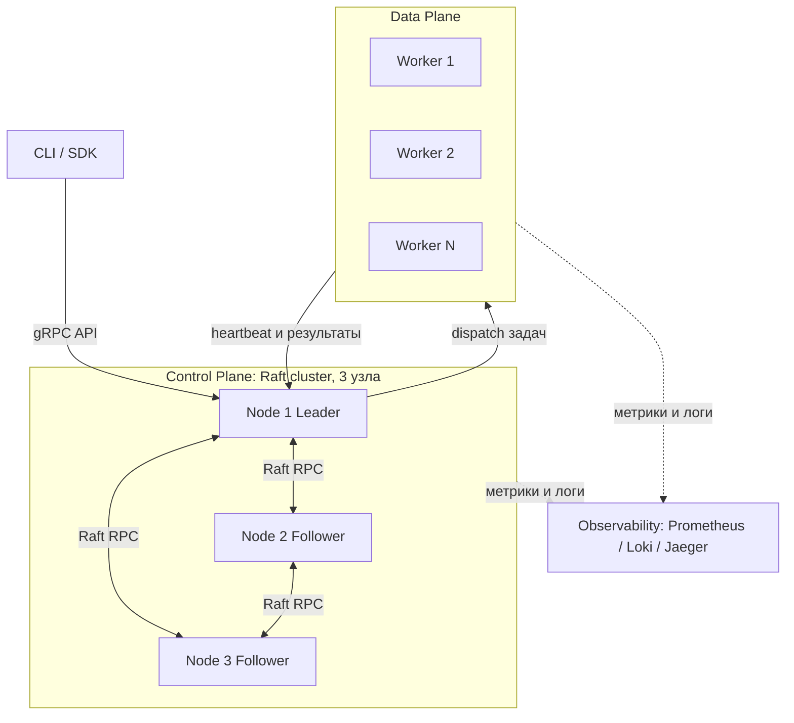

# ТЗ: Распределённая система оркестрации задач (Job/Workflow Orchestrator) на Go

> Основано на roadmap репозитория [Caesarsage/distributed-system](https://github.com/Caesarsage/distributed-system).
> Echo Server и Chat Server (Week 0–1) считаются пройденным этапом — на них вы отработали базовый TCP/сетевой код на Go.
> Этот документ описывает следующий, главный этап: Workflow Engine → Job Scheduler → Orchestration → Raft → Observability → Persistence → Multi-tenancy — как **одну связную систему**, а не 7 разрозненных мини-проектов.

---

## 0. Идея и цель проекта

Вы строите упрощённый аналог систем класса Temporal / Nomad / Kubernetes control-plane:

- пользователь описывает **Workflow** — граф задач (DAG) с зависимостями;
- **Scheduler** раскладывает задачи по **воркерам**;
- кластер из нескольких control-plane узлов **не имеет единой точки отказа** благодаря Raft-консенсусу;
- состояние кластера переживает рестарты (**persistence**);
- всё видно снаружи — логи, метрики, трейсы (**observability**);
- систему можно шарить между несколькими независимыми командами (**multi-tenancy**).

Цель ТЗ — дать вам структуру, интерфейсы, протоколы и последовательность шагов, чтобы вы реализовали это самостоятельно, понимая **зачем** нужен каждый компонент.

---

## 1. Высокоуровневая архитектура



**Принцип разделения ответственности:**

| Слой | Отвечает за | Не отвечает за |
|---|---|---|
| Control Plane (Raft-кластер) | принятие решений: кому какую задачу дать, кто лидер, консистентное состояние | реальное исполнение задач |
| Data Plane (воркеры) | исполнение задач (shell-команда / HTTP-запрос / функция) | принятие решений о расписании |
| Persistence | WAL + snapshot состояния кластера | бизнес-логику |
| Observability | видимость (логи/метрики/трейсы) | работу системы (не должна быть в критическом пути) |

Только **лидер** Raft-кластера принимает запросы на запись (создание workflow, назначение задач). Фолловеры реплицируют журнал и могут отвечать на read-only запросы (с оговорками, см. §7.5).

---

## 2. Доменная модель

Это ядро системы — определите его первым, всё остальное строится вокруг этих структур.

```go
// common/domain/domain.go
package domain

import "time"

// TenantID — идентификатор арендатора (для multi-tenancy)
type TenantID string

// JobID / WorkflowID / TaskID — уникальные идентификаторы (используйте ULID или UUIDv7,
// чтобы они были сортируемы по времени — это удобно для логов и хранилища)
type WorkflowID string
type TaskID string
type ExecutionID string
type WorkerID string

// TaskStatus — конечный автомат состояния задачи
type TaskStatus string

const (
	TaskPending   TaskStatus = "PENDING"   // создана, ждёт, пока разрешатся зависимости
	TaskReady     TaskStatus = "READY"     // зависимости выполнены, ждёт свободного воркера
	TaskDispatched TaskStatus = "DISPATCHED" // отправлена воркеру, ждём подтверждения
	TaskRunning   TaskStatus = "RUNNING"   // воркер подтвердил запуск
	TaskSucceeded TaskStatus = "SUCCEEDED"
	TaskFailed    TaskStatus = "FAILED"
	TaskRetrying  TaskStatus = "RETRYING"
	TaskCancelled TaskStatus = "CANCELLED"
)

// Task — узел графа выполнения (DAG node)
type Task struct {
	ID           TaskID
	WorkflowID   WorkflowID
	Name         string
	DependsOn    []TaskID          // рёбра графа: этот таск ждёт завершения перечисленных
	Command      TaskSpec          // что именно выполнять
	MaxRetries   int
	RetryBackoff time.Duration
	Timeout      time.Duration
	Status       TaskStatus
	AssignedTo   WorkerID
	Attempt      int
	Result       *TaskResult
	CreatedAt    time.Time
	UpdatedAt    time.Time
}

// TaskSpec — абстракция типа задачи. Начните с одного типа (Shell), потом добавите HTTP/gRPC.
type TaskSpec struct {
	Type    string            // "shell" | "http" | "webhook"
	Payload map[string]string // например {"cmd": "echo hello"} или {"url": "...", "method": "POST"}
}

type TaskResult struct {
	ExitCode int
	Stdout   string
	Stderr   string
	Error    string
	Duration time.Duration
}

// WorkflowStatus — состояние графа целиком
type WorkflowStatus string

const (
	WorkflowPending   WorkflowStatus = "PENDING"
	WorkflowRunning   WorkflowStatus = "RUNNING"
	WorkflowSucceeded WorkflowStatus = "SUCCEEDED"
	WorkflowFailed    WorkflowStatus = "FAILED"
	WorkflowCancelled WorkflowStatus = "CANCELLED"
)

// Workflow — DAG задач
type Workflow struct {
	ID        WorkflowID
	TenantID  TenantID
	Name      string
	Tasks     map[TaskID]*Task
	Status    WorkflowStatus
	CreatedAt time.Time
	UpdatedAt time.Time
}

// WorkerNode — регистрация воркера в кластере
type WorkerNode struct {
	ID            WorkerID
	Address       string // host:port для gRPC
	Labels        map[string]string // например {"gpu":"true","region":"eu"} — для селекторов
	Capacity      int    // сколько задач параллельно может исполнять
	RunningTasks  int
	LastHeartbeat time.Time
	Status        WorkerStatus
}

type WorkerStatus string

const (
	WorkerAlive    WorkerStatus = "ALIVE"
	WorkerSuspect  WorkerStatus = "SUSPECT"  // пропустил heartbeat, но ещё в пределах grace period
	WorkerDead     WorkerStatus = "DEAD"
)

// Tenant — для multi-tenancy (см. §10)
type Tenant struct {
	ID        TenantID
	Name      string
	APIKeyHash string
	Quota     ResourceQuota
}

type ResourceQuota struct {
	MaxConcurrentWorkflows int
	MaxTasksPerWorkflow    int
}
```

### Почему DAG, а не просто очередь

Workflow — это направленный ациклический граф: `Task.DependsOn` задаёт рёбра. Планировщик должен:
1. на старте вычислить множество задач без зависимостей → перевести их в `READY`;
2. когда задача переходит в `SUCCEEDED`, пересчитать, у каких задач все `DependsOn` теперь удовлетворены, и перевести их в `READY`;
3. если хоть одна зависимость `FAILED`/`CANCELLED` — зависящие задачи получают `CANCELLED` (или, по политике, `RETRYING` родителя).

Реализуйте валидацию DAG на этапе создания workflow: обход в глубину (DFS) с проверкой посещённых/в процессе узлов для обнаружения циклов — граф с циклом нужно отклонять сразу, до записи в Raft-лог.

---

## 3. Raft-консенсус (сердце Control Plane)

### 3.1 Зачем

Если control-plane — это один процесс, при его падении вы теряете весь кластер. Raft даёт вам:
- **Leader election** — автоматический выбор лидера, если текущий упал;
- **Log replication** — любое изменение состояния (создать workflow, назначить задачу) сначала попадает в реплицируемый журнал, и только когда его подтвердило большинство узлов (`quorum`), оно применяется к состоянию — это гарантирует, что состояние кластера не расходится и не теряется при падении меньшинства узлов.

### 3.2 Рекомендация по реализации

Не пишите Raft с нуля для продакшн-качества — это отдельная большая тема (описана в оригинальной статье Ongaro & Ousterhout, "In Search of an Understandable Consensus Algorithm"). Два варианта:

1. **Учебный путь (рекомендуется, раз цель — разобраться в фундаментали):** реализовать урезанный Raft самостоятельно — только leader election + log replication, без membership changes и log compaction на первой итерации. Это соответствует пунктам "Week 6/7" исходного roadmap.
2. **Инженерный путь:** взять `github.com/hashicorp/raft` как транспорт консенсуса и сосредоточиться на вашей `FSM` (state machine) поверх него — это ближе к тому, как реально устроены Nomad/Consul.

Ниже — контракты, которые нужны в любом случае.

### 3.3 Ключевые структуры

```go
package raft

type NodeState int

const (
	Follower NodeState = iota
	Candidate
	Leader
)

// LogEntry — одна запись реплицируемого журнала
type LogEntry struct {
	Term    uint64
	Index   uint64
	Command []byte // сериализованная команда (см. FSM ниже)
}

// PersistentState — то, что ДОЛЖНО пережить рестарт узла (пишется на диск до ответа на RPC)
type PersistentState struct {
	CurrentTerm uint64
	VotedFor    string // ID узла, за кого проголосовали в CurrentTerm ("" если ни за кого)
	Log         []LogEntry
}

// VolatileState — теряется при рестарте, восстанавливается заново
type VolatileState struct {
	CommitIndex uint64 // индекс последней закоммиченной (подтверждённой большинством) записи
	LastApplied uint64 // индекс последней записи, применённой к FSM
}

// Только для лидера, сбрасывается при каждом новом избрании
type LeaderVolatileState struct {
	NextIndex  map[string]uint64 // для каждого follower: индекс следующей записи для отправки
	MatchIndex map[string]uint64 // для каждого follower: индекс последней подтверждённой записи
}
```

### 3.4 RPC-протокол (2 обязательных RPC)

```go
// RequestVote — рассылается кандидатом при таймауте выборов
type RequestVoteArgs struct {
	Term         uint64
	CandidateID  string
	LastLogIndex uint64
	LastLogTerm  uint64
}
type RequestVoteReply struct {
	Term        uint64
	VoteGranted bool
}

// AppendEntries — используется и для репликации, и как heartbeat (с пустым Entries)
type AppendEntriesArgs struct {
	Term         uint64
	LeaderID     string
	PrevLogIndex uint64
	PrevLogTerm  uint64
	Entries      []LogEntry
	LeaderCommit uint64
}
type AppendEntriesReply struct {
	Term    uint64
	Success bool
	// Optimization: для быстрого отката NextIndex при рассинхроне
	ConflictIndex uint64
	ConflictTerm  uint64
}
```

**Логика в двух словах** (реализуйте это как явный конечный автомат, а не «россыпь goroutine с флагами» — так проще отлаживать):

- Follower стартует election timeout (случайный, например 150–300мс). Если не получил AppendEntries/RequestVote за это время — становится Candidate, увеличивает `CurrentTerm`, голосует за себя, рассылает `RequestVote` остальным.
- Получил большинство голосов → становится Leader, начинает слать периодические `AppendEntries` (heartbeat, интервал заметно меньше election timeout, например 50мс).
- Leader, получив запись от клиента, добавляет её в свой лог, реплицирует через `AppendEntries`, и как только запись подтверждена большинством — коммитит (двигает `CommitIndex`) и применяет к FSM.
- Любой узел, увидевший RPC/reply с бОльшим `Term`, немедленно становится Follower.

### 3.5 FSM — State Machine поверх Raft

Raft-журнал реплицирует **команды**, а не напрямую доменные объекты. Здесь важно разделение по слоям (§14.2): сам интерфейс `FSM` — часть `pkg/raft` и не знает, что такое `Workflow`, а вот конкретные команды и их применение — уже наша бизнес-логика в `infrastructure/control-plane/raftfsm`.

```go
// pkg/raft/fsm.go — generic-интерфейс, ничего не знает о домене
package raft

// FSM — интерфейс, который требует Raft-слой от любого потребителя
type FSM interface {
	Apply(entry LogEntry) (result interface{}, err error)
	Snapshot() (FSMSnapshot, error)
	Restore(snapshot []byte) error
}
```

```go
// infrastructure/control-plane/raftfsm/fsm.go — конкретная реализация под наш домен
package raftfsm

import (
	"distributed-orchestrator/common/domain"
	"distributed-orchestrator/pkg/raft"
)

type CommandType string

const (
	CmdCreateWorkflow   CommandType = "CREATE_WORKFLOW"
	CmdUpdateTaskStatus CommandType = "UPDATE_TASK_STATUS"
	CmdRegisterWorker   CommandType = "REGISTER_WORKER"
	CmdWorkerHeartbeat  CommandType = "WORKER_HEARTBEAT"
	CmdAssignTask       CommandType = "ASSIGN_TASK"
)

type Command struct {
	Type    CommandType
	Payload []byte // JSON/protobuf-сериализованный конкретный тип команды
}

// OrchestratorFSM реализует raft.FSM поверх доменной модели из common/domain
type OrchestratorFSM struct {
	workflows map[domain.WorkflowID]*domain.Workflow
	workers   map[domain.WorkerID]*domain.WorkerNode
}

func (f *OrchestratorFSM) Apply(entry raft.LogEntry) (interface{}, error) {
	// десериализовать entry.Command в Command, диспетчеризовать по Type
	// см. §3.6 про детерминизм
	return nil, nil
}
```

Важно: `Apply` должен быть **детерминированным** — одинаковый вход даёт одинаковый выход на всех узлах (никаких `time.Now()`, `rand`, обращений к сети внутри `Apply`; время передавайте как поле команды, проставленное на этапе создания записи лидером).

### 3.6 Чтения: линеаризуемость vs производительность

- **Строгие чтения** (например, "актуальный статус workflow прямо сейчас"): лидер перед ответом должен подтвердить, что он всё ещё лидер (например, разослать heartbeat-раунд и дождаться quorum-ответов — это называется *read index*). Простая учебная версия: все reads тоже идут через лог (дорого, но просто и корректно).
- **Eventually-consistent чтения** (для дашборда, где не критична секундная задержка): можно читать с фолловеров напрямую из их локального применённого состояния.

Начните с первого варианта (просто и корректно), оптимизацию до read-index сделайте отдельным этапом, когда база уже работает.

---

## 4. Workflow Engine

Отвечает за интерпретацию DAG и переходы состояний задач. Работает **поверх FSM**, то есть каждое изменение статуса — это команда, проходящая через Raft.

```go
// infrastructure/control-plane/engine/engine.go
package engine

import (
	"distributed-orchestrator/common/domain"
	"distributed-orchestrator/pkg/raft"
)

type WorkflowEngine struct {
	fsm  raft.FSM  // интерфейс из pkg/raft; конкретно — *raftfsm.OrchestratorFSM
	node raft.Node // текущий узел Raft (нужен, чтобы знать: лидер ли я)
}

// SubmitWorkflow вызывается из API. Валидирует DAG, затем проводит через Raft.
func (e *WorkflowEngine) SubmitWorkflow(ctx context.Context, wf domain.Workflow) (domain.WorkflowID, error)

// OnTaskCompleted вызывается, когда Scheduler получил результат от воркера.
// Пересчитывает READY-множество для зависимых задач.
func (e *WorkflowEngine) OnTaskCompleted(ctx context.Context, taskID domain.TaskID, result domain.TaskResult) error

// recomputeReadyTasks — приватная функция: топологический пересчёт готовых к запуску задач
func (e *WorkflowEngine) recomputeReadyTasks(wf *domain.Workflow) []domain.TaskID
```

**Валидация DAG при создании** (обязательно, до попадания в Raft-лог, чтобы не тратить консенсус на заведомо невалидные данные):
1. Все `TaskID` в `DependsOn` существуют в рамках этого workflow.
2. Нет циклов (DFS с тремя цветами: white/gray/black).
3. Нет "осиротевших" задач без пути к корню (опционально, по вашей политике).

---

## 5. Job Scheduler

Раскладывает `READY`-задачи по воркерам.

```go
// infrastructure/control-plane/scheduler/scheduler.go
package scheduler

type Scheduler struct {
	workerRegistry *WorkerRegistry
	queue          *ReadyQueue // задачи в статусе READY, ждущие назначения
}

// Assign — вызывается по таймеру/событию. Забирает задачи из очереди READY
// и подбирает воркер под каждую.
func (s *Scheduler) Assign(ctx context.Context) error

// SelectWorker — алгоритм подбора. Начните с простого, усложняйте по мере роста требований.
func (s *Scheduler) SelectWorker(task domain.Task, workers []domain.WorkerNode) (domain.WorkerID, error)
```

**Алгоритмы `SelectWorker`, от простого к сложному** (реализуйте по очереди, это хороший инкрементальный план):
1. *Round-robin* среди `ALIVE`-воркеров с `RunningTasks < Capacity`.
2. *Least-loaded* — воркер с минимальным `RunningTasks / Capacity`.
3. *Label selector* — задача может требовать `Labels` (например `gpu: true`), фильтруем воркеров по совпадению меток до применения least-loaded.
4. (опционально) *Bin-packing* с учётом заявленных ресурсов задачи (cpu/mem), если добавите такие поля в `TaskSpec`.

**Важно:** назначение задачи воркеру — это тоже команда через Raft (`CmdAssignTask`), а не прямой gRPC-вызов из планировщика напрямую в воркер до записи в лог. Порядок:
1. Лидер решает: `task X → worker Y`.
2. Лидер проводит `AssignTask` через Raft (реплицируется, коммитится).
3. Только после коммита — лидер реально шлёт gRPC-вызов воркеру `Dispatch(task)`.

Это гарантирует: если лидер упадёт сразу после решения, но до отправки — новый лидер увидит из лога, что задача уже назначена, и либо повторно отправит, либо (с timeout) сочтёт назначение протухшим и переназначит.

---

## 6. Кластерная оркестрация: воркеры

### 6.1 Регистрация и heartbeat

```protobuf
// docs/proto/worker.proto — сгенерированный код -> common/api/workerpb
service WorkerService {
  rpc Register(RegisterRequest) returns (RegisterResponse);
  rpc Heartbeat(HeartbeatRequest) returns (HeartbeatResponse);
  rpc Dispatch(DispatchRequest) returns (DispatchResponse);   // control-plane -> worker
  rpc ReportResult(ResultRequest) returns (ResultResponse);   // worker -> control-plane
}

message RegisterRequest {
  string worker_id = 1;
  string address = 2;
  map<string, string> labels = 3;
  int32 capacity = 4;
}

message HeartbeatRequest {
  string worker_id = 1;
  int32 running_tasks = 2;
}

message DispatchRequest {
  string task_id = 1;
  string type = 2;              // "shell" | "http"
  map<string, string> payload = 3;
  int64 timeout_seconds = 4;
}

message ResultRequest {
  string task_id = 1;
  int32 exit_code = 2;
  string stdout = 3;
  string stderr = 4;
  string error = 5;
}
```

### 6.2 Health checking (failure detection)

Воркер шлёт `Heartbeat` каждые `heartbeat_interval` (например 5с). Control-plane:
- если пропущено `> N` интервалов подряд → `WorkerSuspect`;
- если пропущено `> M` (M > N) → `WorkerDead`, все его `DISPATCHED/RUNNING` задачи переводятся обратно в `READY` и переназначаются другому воркеру (это идемпотентная операция — учитывайте, что старый воркер может "ожить" и всё же прислать результат: игнорируйте результат, если задача уже переназначена другому `AssignedTo`).

Это классическая проблема распределённых систем — **невозможно надёжно отличить "воркер упал" от "воркер медленный/сеть моргнула"**. Отсюда следует требование: задачи должны быть по возможности **идемпотентны**, либо система должна поддерживать at-least-once с дедупликацией по `ExecutionID`.

### 6.3 Исполнение задачи на воркере

```go
// infrastructure/worker/executor/executor.go
package executor

type Executor interface {
	Execute(ctx context.Context, spec domain.TaskSpec, timeout time.Duration) (domain.TaskResult, error)
}

// ShellExecutor — первая реализация: выполняет payload["cmd"] через os/exec
type ShellExecutor struct{}

// HTTPExecutor — дергает payload["url"] методом payload["method"]
type HTTPExecutor struct{ client *http.Client }
```

Воркер держит пул из `Capacity` goroutine-слотов (используйте `chan struct{}` как семафор или `errgroup` с лимитом), исполняет задачу с `context.WithTimeout`, по завершении вызывает `ReportResult`.

---

## 7. Persistence

### 7.1 Что нужно хранить

| Что | Зачем | Где |
|---|---|---|
| Raft log (`LogEntry[]`) | восстановление журнала после рестарта узла | локально на диске каждого control-plane узла |
| Raft snapshot | чтобы не реплицировать лог с нуля бесконечно — компакция | локально, периодически |
| Текущее состояние FSM (workflows, tasks, workers) | быстрый доступ на чтение, восстановление после `Restore` | in-memory + периодический snapshot на диск |

### 7.2 Рекомендуемый стек

- **Локальное key-value хранилище на узел:** `BoltDB` (`etcd-io/bbolt`) или `BadgerDB` — обе Go-нативные, embedded, ACID для локальной записи лога.
- Схема ключей в Bolt для лога: bucket `raft_log`, ключ = `binary.BigEndian` от `Index`, значение = сериализованный `LogEntry`.
- Отдельный bucket `raft_meta` — `CurrentTerm`, `VotedFor`.
- Snapshot FSM — просто сериализуйте всю карту `workflows map[WorkflowID]*Workflow` и `workers map[WorkerID]*WorkerNode` (JSON для простоты на старте, protobuf/gob для производительности потом) и пишите как один blob + метаданные (`LastIncludedIndex`, `LastIncludedTerm`).

### 7.3 WAL-принцип

**Правило: ничего не отвечать вызывающему как "успех", пока данные не легли на диск.** Follower обязан `fsync` новую запись `AppendEntries` до отправки `Success: true`. Это то, что отличает игрушечную реализацию от рабочей — без этого при потере питания узла вы теряете "подтверждённые" данные.

### 7.4 Log compaction

Без компакции лог растёт бесконечно и рестарт узла становится всё дольше. Правило: когда `log length > threshold` (например 10000 записей), лидер (и остальные, независимо) делают snapshot текущего состояния FSM и обрезают лог до `LastIncludedIndex`. Узлам, слишком сильно отставшим (нужная им запись уже обрезана), лидер шлёт `InstallSnapshot` RPC целиком вместо `AppendEntries`.

---

## 8. Observability

Три столпа, все три обязательны в MVP, не опционально:

### 8.1 Структурированные логи

Используйте `log/slog` (стандартная библиотека, начиная с Go 1.21) или `zerolog`. Каждая запись — JSON, обязательные поля: `ts`, `level`, `component` (`raft`/`scheduler`/`worker`/`api`), `node_id`, `trace_id` (см. ниже), плюс контекстные (`workflow_id`, `task_id`).

```go
logger.Info("task dispatched",
    "task_id", task.ID,
    "worker_id", worker.ID,
    "attempt", task.Attempt,
)
```

### 8.2 Метрики (Prometheus)

Минимальный набор:

| Компонент | Метрика | Тип | Описание |
|---|---|---|---|
| Raft | `raft_current_term{node_id}` | gauge | текущий term узла |
| Raft | `raft_state{node_id}` | gauge | 0=follower, 1=candidate, 2=leader |
| Raft | `raft_log_length{node_id}` | gauge | длина лога на узле |
| Raft | `raft_commit_index{node_id}` | gauge | индекс последней закоммиченной записи |
| Raft | `raft_apply_duration_seconds` | histogram | время применения записи к FSM |
| Scheduler | `scheduler_ready_queue_length` | gauge | сколько задач в очереди READY |
| Scheduler | `scheduler_assign_duration_seconds` | histogram | время подбора воркера под задачу |
| Scheduler | `tasks_total{status}` | counter | количество задач по статусам |
| Worker | `worker_capacity{worker_id}` | gauge | заявленная ёмкость воркера |
| Worker | `worker_running_tasks{worker_id}` | gauge | сколько задач выполняется сейчас |
| Worker | `worker_task_duration_seconds{task_type}` | histogram | длительность исполнения задачи |
| Worker | `worker_heartbeat_misses_total{worker_id}` | counter | пропущенные heartbeat подряд |

Поднимайте `/metrics` HTTP endpoint (`promhttp.Handler()`) на каждом узле, соберите `docker-compose` с Prometheus + Grafana для визуализации (это соответствует пункту "Week 8: Observability" из исходного roadmap).

### 8.3 Трейсинг (OpenTelemetry)

Прокиньте единый `trace_id` через весь путь запроса: API → Raft-команда (положите `trace_id` в саму команду, не только в контекст процесса, иначе потеряете его при репликации!) → dispatch воркеру (передавайте в metadata gRPC-вызова) → результат. Это даст вам возможность в Jaeger увидеть полный путь одной задачи через весь кластер — критично для отладки распределённой системы, где `fmt.Println` уже не спасает.

---

## 9. Multi-tenancy

### 9.1 Модель

- Каждый `Workflow` принадлежит `TenantID`.
- API-запросы аутентифицируются по API-ключу (заголовок `Authorization: Bearer <key>`), ключ маппится на `TenantID` через `sha256`-хэш, сверяемый с `Tenant.APIKeyHash`.
- **Изоляция на уровне Scheduler:** очередь `READY`-задач партиционируется по тенанту, и при подборе воркера применяется round-robin **между тенантами**, а не просто FIFO по времени создания — иначе один "шумный" тенант с 10000 задач заблокирует всех остальных (проблема "noisy neighbor").
- **Квоты:** перед `SubmitWorkflow` проверяйте `ResourceQuota` — если у тенанта уже `MaxConcurrentWorkflows` активных workflow, новый запрос отклоняется с ошибкой `ResourceExhausted`, а не молча встаёт в бесконечную очередь.

### 9.2 Пример middleware

Сам интерсептор — доменная логика (знает про `Tenant`), поэтому живёт в `infrastructure/control-plane/tenancy`, а не в `pkg/grpcmw`. В `pkg/grpcmw` при этом стоит держать *generic*-цепочку (logging/tracing/recovery-интерсепторы), которая ничего не знает про тенантов и переиспользуется и на control-plane, и на воркере.

```go
// infrastructure/control-plane/tenancy/middleware.go
package tenancy

func TenantAuthMiddleware(tenants TenantStore) grpc.UnaryServerInterceptor {
	return func(ctx context.Context, req interface{}, info *grpc.UnaryServerInfo, handler grpc.UnaryHandler) (interface{}, error) {
		key, err := extractAPIKey(ctx)
		if err != nil {
			return nil, status.Error(codes.Unauthenticated, "missing api key")
		}
		tenant, err := tenants.LookupByKey(ctx, key)
		if err != nil {
			return nil, status.Error(codes.Unauthenticated, "invalid api key")
		}
		ctx = context.WithValue(ctx, tenantCtxKey{}, tenant.ID)
		return handler(ctx, req)
	}
}
```

---

## 10. API

### 10.1 gRPC (control-plane ↔ клиент/воркеры)

Источник — `docs/proto/orchestrator.proto`; сгенерированный код (`protoc`/`buf`) кладите в `common/api/orchestratorpb`, чтобы им могли пользоваться и control-plane (реализация сервиса), и CLI (клиент), и, при необходимости, воркер.

```protobuf
service OrchestratorAPI {
  rpc SubmitWorkflow(SubmitWorkflowRequest) returns (SubmitWorkflowResponse);
  rpc GetWorkflow(GetWorkflowRequest) returns (WorkflowStatusResponse);
  rpc CancelWorkflow(CancelWorkflowRequest) returns (CancelWorkflowResponse);
  rpc StreamWorkflowEvents(GetWorkflowRequest) returns (stream WorkflowEvent); // для CLI: live-статус
}
```

### 10.2 CLI (тонкий клиент поверх gRPC)

```text
orc submit workflow.yaml
orc get workflow <id>
orc watch workflow <id>          # стриминг событий
orc cluster status                # кто лидер, кто follower, кто down
orc worker list
```

### 10.3 Формат описания workflow (YAML, парсится в domain.Workflow)

```yaml
name: build-and-deploy
tasks:
  - id: build
    command: {type: shell, cmd: "go build ./..."}
  - id: test
    depends_on: [build]
    command: {type: shell, cmd: "go test ./..."}
  - id: deploy
    depends_on: [test]
    command: {type: http, url: "https://deploy.internal/api", method: POST}
    max_retries: 3
    timeout: 60s
```

---

## 11. Нефункциональные требования

| Категория | Требование |
|---|---|
| Отказоустойчивость | Кластер из 3 control-plane узлов продолжает работать при падении 1 узла (quorum = 2 из 3); из 5 — при падении 2. |
| Консистентность | Ни одна подтверждённая клиенту запись не должна теряться при падении меньшинства узлов (проверяется через chaos-тесты, см. §12). |
| Производительность (MVP-ориентир) | ≥ 500 task assignment/sec на 3-узловом кластере на обычном ноутбуке; задержка `SubmitWorkflow` p99 < 100мс без учёта времени исполнения задач. |
| Восстановление | Рестарт узла с диска (log + snapshot) < 5с для лога в 10k записей. |
| Безопасность | Все gRPC-соединения между узлами и воркерами — mTLS (на поздней стадии; на MVP допустим TLS без взаимной аутентификации). API-ключи хранятся только как хэши. |

---

## 12. Тестирование

1. **Unit-тесты** для каждого пакета: `raftfsm.Apply` (детерминизм — один и тот же вход → один и тот же выход, прогнать 2 раза и сравнить), DAG-валидация (циклы, несуществующие зависимости), `SelectWorker`.
2. **Property-based / table-driven тесты** для Raft: набор сценариев "какой лидер выберется при таких-то Term/Log у узлов".
3. **Интеграционные тесты в docker-compose**: поднять 3 control-plane + 2 worker контейнера, прогнать полный workflow end-to-end.
4. **Chaos-тесты** (это то, что реально отличает "я прочитал про Raft" от "я понимаю Raft"):
   - убить лидера `SIGKILL` во время активной репликации → проверить, что новый лидер избирается и данные не потеряны;
   - искусственный network partition (`iptables`/`tc netem` в docker) — меньшинство не должно принимать записи;
   - убить воркера во время `RUNNING` задачи → задача должна переназначиться.
5. **Нагрузочный тест**: `k6`/собственный Go-generator, отправляющий N workflow/sec, снимайте метрики из §8.2.

---

## 13. Технологический стек (рекомендации)

| Слой | Технология |
|---|---|
| Язык | Go 1.22+ |
| RPC | gRPC + protobuf |
| Consensus | собственная реализация (учебная цель) или `hashicorp/raft` |
| Local storage | `etcd-io/bbolt` |
| Логи | `log/slog` (stdlib) |
| Метрики | `prometheus/client_golang` |
| Трейсинг | `go.opentelemetry.io/otel` + Jaeger exporter |
| CLI | `spf13/cobra` |
| Конфиги | YAML (`gopkg.in/yaml.v3`) |
| Тесты | стандартный `testing` + `testify/require`, `testcontainers-go` для интеграционных |
| Оркестрация окружения для разработки | `docker-compose`, позже — деплой в MiniKube (пункт "Week 5" исходного roadmap как отдельная веха) |

---

## 14. Структура репозитория (монорепа)

Идея: **`pkg`** — код, который не знает о предметной области вообще (можно вынести в другой проект без единой правки), **`common`** — общий код, специфичный именно для этой системы, но нужный и control-plane, и воркеру, **`infrastructure`** — конкретные исполняемые сервисы, которые эти два слоя используют.

```text
distributed-orchestrator/
├── go.mod                          # единый модуль (см. §14.3 про go.work, если нужно строже)
├── cmd/
│   ├── control-plane/main.go       # запуск узла control-plane
│   ├── worker/main.go              # запуск воркера
│   └── orc/main.go                 # CLI-клиент
│
├── common/
│   ├── domain/                     # §2: Task, Workflow, WorkerNode, Tenant, статусы, доменные ошибки
│   ├── api/                        # сгенерированный из proto код (protogen), общий контракт control-plane <-> worker <-> client
│   │   ├── orchestratorpb/         # *.pb.go, *_grpc.pb.go из docs/proto/orchestrator.proto
│   │   └── workerpb/                # то же для docs/proto/worker.proto
│   └── util/                        # ID-генерация (ULID/UUIDv7), DAG-валидация (поиск циклов),
│                                     # конвертеры domain <-> protobuf, общие retry/backoff-хелперы
│
├── infrastructure/
│   ├── control-plane/
│   │   ├── raftfsm/                 # §3.5: FSM ИМЕННО под наши команды (CmdCreateWorkflow и т.д.),
│   │   │                            # реализует интерфейс fsm.FSM из pkg/raft
│   │   ├── engine/                  # §4: workflow engine, пересчёт READY-задач
│   │   ├── scheduler/               # §5: подбор воркера под задачу
│   │   ├── orchestration/           # §6: реестр воркеров, heartbeat, health-check
│   │   ├── storage/                 # §7: схема хранения workflow/task поверх pkg/boltstore
│   │   ├── tenancy/                 # §9: тенанты, квоты, API-ключи
│   │   └── grpcserver/              # §10: реализация OrchestratorAPI (использует common/api)
│   │
│   └── worker/
│       ├── executor/                 # ShellExecutor, HTTPExecutor (§6.3)
│       ├── clusterclient/            # регистрация в control-plane, отправка heartbeat
│       └── grpcserver/               # реализация WorkerService.Dispatch (§6.1)
│
├── pkg/
│   ├── raft/                        # §3: универсальный consensus-движок — node/election/log/rpc/fsm-интерфейс.
│   │                                 # НИЧЕГО не знает про Task/Workflow — только LogEntry и абстрактный Command []byte
│   ├── boltstore/                   # generic-обёртка над bbolt: Put/Get/Iterate/Snapshot, WAL-паттерн
│   ├── observability/               # инициализация slog-логгера, prometheus-registry, otel-tracer
│   ├── grpcmw/                      # grpc-интерсепторы: auth, logging, tracing, panic-recovery
│   └── idgen/                       # обёртка над ULID/UUIDv7
│
├── docs/
│   ├── proto/                       # исходники .proto — единственный источник правды для common/api
│   │   ├── orchestrator.proto
│   │   └── worker.proto
│   ├── swagger/                     # openapi.yaml (если добавите grpc-gateway для REST поверх gRPC API)
│   └── architecture.md              # диаграмма из §1, ADR по ключевым решениям
│
├── deploy/
│   ├── docker-compose.yaml
│   └── k8s/                         # манифесты для MiniKube-этапа (Week 5 исходного roadmap)
│
└── test/
    ├── integration/                 # docker-compose кластер + сценарии end-to-end
    └── chaos/                       # kill leader, network partition, kill worker (§12)
```

### 14.1 Что куда класть — правило одной фразы

| Папка | Критерий "это сюда" |
|---|---|
| `pkg/` | Код не импортирует ничего из `common/` и `infrastructure/`. Если убрать этот пакет и вставить в пустой репозиторий — он скомпилируется. |
| `common/` | Знает про домен (Task/Workflow/Tenant) или про wire-протокол (protobuf), но не знает, control-plane это использует или worker. |
| `infrastructure/control-plane/*` | Бизнес-логика, которая существует только на стороне control-plane (принятие решений, консенсус, планирование). |
| `infrastructure/worker/*` | Логика, существующая только на стороне воркера (исполнение задач). |

### 14.2 Правило зависимостей (направление стрелок)

```text
infrastructure/control-plane  ──┐
                                 ├──>  common  ──>  pkg
infrastructure/worker         ──┘
```

- `pkg/*` не зависит ни от кого — самый нижний слой.
- `common/*` может зависеть от `pkg/*`, но не от `infrastructure/*`.
- `infrastructure/control-plane` и `infrastructure/worker` зависят от `common/*` и `pkg/*`, но **не друг от друга** на уровне Go-пакетов — они два разных бинарника (`cmd/control-plane`, `cmd/worker`) и общаются между собой только по сети через контракт из `common/api` (то есть через тот же gRPC, что видит и внешний клиент). Так вы физически не сможете случайно "срезать угол" и вызвать внутреннюю функцию другого сервиса напрямую в обход протокола — что как раз то, ради чего вы строите распределённую систему, а не монолит.

Если хотите, чтобы это правило проверялось автоматически, а не на честном слове — добавьте в CI `golangci-lint` с правилом `depguard`, запрещающим `pkg/*` импортировать `common/*` или `infrastructure/*`, и `infrastructure/control-plane/*` импортировать `infrastructure/worker/*` (и наоборот).

### 14.3 Опционально: `pkg` как отдельные Go-модули

Если цель `pkg` — не просто "папка с намерением переиспользовать", а буквально вытащить пакет `pkg/raft` в отдельный публичный репозиторий когда-нибудь — заведите `go.work` в корне и отдельный `go.mod` в каждой подпапке `pkg/*`:

```text
distributed-orchestrator/
├── go.work
├── go.mod                # модуль на common + infrastructure + cmd
└── pkg/
    ├── raft/go.mod        # отдельный модуль, свой номер версии
    ├── boltstore/go.mod
    └── observability/go.mod
```

Это усложняет разработку (нужно синхронизировать версии через `go.work`), поэтому на старте разумно ограничиться единым `go.mod` на весь репозиторий и соблюдать правило зависимостей из §14.2 дисциплиной/линтером, а к отдельным модулям переходить только когда реально понадобится опубликовать `pkg/raft` как самостоятельную библиотеку.

---

## 15. План разработки по вехам (мэппинг на исходный roadmap)

Каждая веха должна быть демонстрируемой (можно показать работающий кусок), а не "написал код, но не проверил".

| Этап | Содержание | Definition of Done |
|---|---|---|
| **1. Workflow Engine (соло, без кластера)** | `domain`, DAG-валидация, `WorkflowEngine` поверх in-memory FSM (без Raft пока) | Можно из кода создать Workflow с 3 задачами и зависимостями, увидеть корректный порядок READY-переходов в логах |
| **2. Job Scheduler + один воркер** | `Scheduler`, gRPC `WorkerService`, `ShellExecutor` | Workflow из этапа 1 реально исполняется на локальном воркере, статусы обновляются по результатам |
| **3. Несколько воркеров + Orchestration** | Регистрация, heartbeat, health check, переназначение при падении воркера | Убить воркер во время исполнения → задача переназначается другому и завершается |
| **4. Raft: leader election** | `RequestVote`, election timeout, состояние Follower/Candidate/Leader | 3-узловой кластер стабильно выбирает лидера, при `kill -9` лидера новый выбирается за секунды |
| **5. Raft: log replication + FSM интеграция** | `AppendEntries`, `Apply`, все команды из §3.5 идут через Raft | Все команды из этапов 1-3 теперь проходят через Raft-лог, а не напрямую |
| **6. Persistence** | bbolt для лога/snapshot, `Restore` при старте | Рестарт узла восстанавливает состояние без потери данных |
| **7. Observability** | slog + Prometheus + Jaeger, docker-compose со стеком | Dashboard в Grafana показывает live-метрики кластера при прогоне нагрузочного теста |
| **8. Multi-tenancy** | Tenant, API keys, квоты, партиционирование очереди | Два разных API-ключа видят только свои workflows, превышение квоты корректно отклоняется |
| **9. Performance & polish** | профилирование (`pprof`), устранение узких мест, документация | Достигнуты ориентиры из §11, README с архитектурной диаграммой и инструкцией запуска |

---

## 16. Полезные первоисточники

- Raft: *"In Search of an Understandable Consensus Algorithm"*, Ongaro & Ousterhout — читайте до реализации §3, а не вместо неё.
- MapReduce: у вас уже есть реализация в репозитории — сравните архитектурные решения (master/worker, heartbeat, переназначение при таймауте) с §5–6 этого ТЗ, они концептуально похожи.
- Про идемпотентность и at-least-once delivery — полезно посмотреть, как эту проблему решает Temporal.io (не копировать код, просто понять модель).

---

Если на каком-то этапе понадобится более глубокая детализация конкретного модуля (например, полный псевдокод election timeout с обработкой race conditions, или схема bbolt-бакетов) — можно расписать отдельно, когда дойдёте до этого этапа.